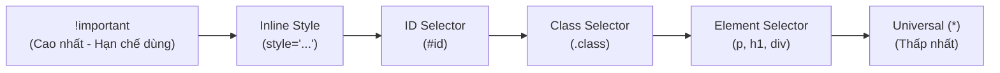

# 📚 SỔ TAY ÔN TẬP HTML (W3SCHOOLS & PHỎNG VẤN THỰC TẬP)

> Sổ tay tổng hợp toàn bộ kiến thức HTML từ cơ bản đến nâng cao, chuẩn ngữ nghĩa (Semantic), SEO và Accessibility (a11y).

---

## 🗺️ LỘ TRÌNH ÔN TẬP HTML

- [x] **Chủ đề 1: Thẻ cốt lõi & Cấu trúc cơ bản** (`h1-h6`, `p`, `a`, `img`)
- [x] **Chủ đề 2: Thuộc tính toàn diện (HTML Attributes)** (`Global`, `Specific`, `Boolean`, `data-*`, `a11y/security attributes`)
- [x] **Chủ đề 3: Định dạng văn bản & Text Semantics** (`strong`, `em`, `mark`, `code`, `pre`, `blockquote`, `br`, `hr`)
- [x] **Chủ đề 4: Màu sắc & Hệ màu trong CSS** (`RGB`, `HEX`, `HSL`, `Color Names`)
- [x] **Chủ đề 5: Các cách gọi CSS, Thẻ `<link>`, `@import` & Thứ tự ưu tiên** (`Inline`, `Internal`, `External`, `Specificity`)
- [x] **Chủ đề 6: HTML Links Toàn Diện** (`target: _blank, _self, _parent, _top`, `mailto:`, `tel:`, `Bookmark #`, `rel: noopener/nofollow`)
- [x] **Chủ đề 7: HTML Images & Thẻ `<picture>` Toàn Diện** (`alt`, `Responsive`, `Image Map`, `picture/source`, `loading="lazy"`)
- [x] **Chủ đề 8: Danh sách Toàn Diện (HTML Lists)** (`ul`, `ol`, `li`, `dl`, `dt`, `dd`, `nested lists`, `menu navigation`)
- [x] **Chủ đề 9: Bảng Dữ Liệu Toàn Diện (HTML Tables)** (`table`, `thead`, `tbody`, `tfoot`, `tr`, `th`, `td`, `colspan`, `rowspan`, `caption`)
- [x] **Chủ đề 10: Khối & Nội dòng (Block vs Inline)** (`div`, `span`, `Block vs Inline vs Inline-Block`, `iframe`)
- [x] **Chủ đề 11: Định danh & Phân nhóm Toàn Diện** (`id vs class`, `Quy tắc đặt tên`, `HTML vs CSS vs JS`, `Tại sao CSS ưu tiên class`)
- [x] **Chủ đề 12: HTML5 Semantic (Thẻ ngữ nghĩa bố cục)** (`header`, `nav`, `main`, `section`, `article`, `aside`, `footer`, `figure`, `time`)
- [x] **Chủ đề 13: Biểu mẫu toàn diện (HTML Forms & Validation)** (`form`, `input types`, `label`, `button`, `select`, `textarea`, `fieldset`, `datalist`, `validation`)
- [x] **Chủ đề 14: Thẻ `<head>`, Meta & Tối ưu SEO** (`meta viewport`, `meta description`, `Open Graph`, `favicon`, `defer/async`)
- [x] **Chủ đề 15: Đa phương tiện & Thẻ hiện đại** (`video`, `audio`, `svg`, `canvas`, `dialog`, `details/summary`, `HTML entities`)

---

## 📖 NỘI DUNG CHI TIẾT

### CHỦ ĐỀ 1: THẺ CỐT LÕI & CẤU TRÚC CƠ BẢN

<details>
<summary><b>1. <code>&lt;h1&gt;</code> đến <code>&lt;h6&gt;</code>: Thẻ tiêu đề (Headings)</b> <i>(Bấm để xem)</i></summary>

* **Cú pháp:**
  ```html
  <h1>Tiêu đề trang</h1>
  <h2>Tiêu đề mục lớn</h2>
  <h3>Tiêu đề mục con</h3>
  ```
* **Bản chất & Lưu ý phỏng vấn:**
  * Thể hiện **cấp bậc phân cấp nội dung** (giống mục lục 1. -> 1.1 -> 1.1.1).
  * ⚠️ **Quy tắc SEO:** Mỗi trang chỉ có **1 thẻ `<h1>` duy nhất** đại diện cho nội dung cốt lõi của trang.
  * Không dùng thẻ `h` chỉ để chỉnh cỡ chữ (cỡ chữ là việc của CSS `font-size`).
  * Là thẻ **Block element** (chiếm trọn 1 dòng).
</details>

<br>

<details>
<summary><b>2. <code>&lt;p&gt;</code>: Đoạn văn bản (Paragraph)</b> <i>(Bấm để xem)</i></summary>

* **Cú pháp:**
  ```html
  <p>Đây là đoạn văn bản mô tả nội dung...</p>
  ```
* **Bản chất & Lưu ý:**
  * Dùng cho đoạn văn bản thông thường. Trình duyệt tự sinh khoảng cách lề trên/dưới (`margin`).
  * Là thẻ **Block element**.
  * ⚠️ **Lỗi thường gặp:** Không được lồng các thẻ block khác (`<div>`, `<h1>-<h6>`, `<p>`) vào bên trong `<p>`.
</details>

<br>

<details>
<summary><b>3. <code>&lt;a&gt;</code>: Thẻ liên kết (Anchor Link)</b> <i>(Bấm để xem)</i></summary>

* **Cú pháp:**
  ```html
  <a href="https://example.com" target="_blank" rel="noopener noreferrer">Đến trang web</a>
  ```
* **Thuộc tính quan trọng:**
  * `href`: Địa chỉ đích (`https://...`, đường dẫn file `./about.html`, neo `#section-id`, `mailto:`, `tel:`).
  * `target="_blank"`: Mở liên kết trong tab mới.
  * 🛡️ **Bảo mật (Cực hay hỏi phỏng vấn):** Luôn đi kèm `rel="noopener noreferrer"` khi dùng `target="_blank"` để chống tấn công chiếm quyền tab (*Reverse Tabnabbing*).
  * Là thẻ **Inline element** (chỉ chiếm diện tích vừa đủ chữ, có thể nằm chung hàng với chữ khác).
</details>

<br>

<details>
<summary><b>4. <code>&lt;img&gt;</code>: Thẻ hình ảnh (Image)</b> <i>(Bấm để xem)</i></summary>

* **Cú pháp:**
  ```html
  
  ```
* **Thuộc tính bắt buộc & Tối ưu:**
  * Là **thẻ tự đóng (void element)**, không có `</img>`.
  * `src`: Đường dẫn tới file ảnh.
  * `alt`: Mô tả ảnh (Bắt buộc) -> Hiện khi ảnh lỗi, dùng cho người khiếm thị (**Screen Reader / a11y**) và **Google SEO**.
  * `width`/`height`: Khai báo kích thước trước để tránh giật layout khi load web (**CLS - Cumulative Layout Shift**).
  * `loading="lazy"`: Tối ưu tốc độ tải trang, chỉ load ảnh khi người dùng cuộn tới.
</details>

---

### CHỦ ĐỀ 2: THUỘC TÍNH TOÀN DIỆN (HTML ATTRIBUTES)

#### A. Nhóm Global Attributes (Dùng cho mọi thẻ)

<details>
<summary><b>1. <code>id</code>: Tên định danh duy nhất</b> <i>(Bấm để xem)</i></summary>

* **Mục đích:** Đặt tên định danh **độc nhất** cho một phần tử trên toàn trang (không được trùng).
* **Cú pháp:**
  ```html
  <h1 id="main-title">Tiêu đề chính</h1>
  <a href="#main-title">Cuộn lên tiêu đề chính</a>
  ```
* **Ứng dụng:** Làm neo trang (`#id`), dùng cho JavaScript `document.getElementById('main-title')`, và viết CSS `#main-title`.
</details>

<br>

<details>
<summary><b>2. <code>class</code>: Gán nhãn nhóm phần tử</b> <i>(Bấm để xem)</i></summary>

* **Mục đích:** Phân nhóm các phần tử để dùng chung định dạng CSS hoặc JavaScript.
* **Cú pháp:**
  ```html
  <p class="text-danger font-bold">Lỗi cảnh báo 1</p>
  <p class="text-danger">Lỗi cảnh báo 2</p>
  ```
* **Lưu ý:** 1 thẻ có thể có nhiều class, cách nhau bằng dấu cách. Nhiều thẻ khác nhau có thể chung class.
</details>

<br>

<details>
<summary><b>3. <code>title</code>: Chú thích khi rê chuột (Tooltip)</b> <i>(Bấm để xem)</i></summary>

* **Mục đích:** Hiển thị một khung chú thích nhỏ khi người dùng rê chuột (hover) vào phần tử.
* **Cú pháp:**
  ```html
  <p title="Bấm vào đây để xem chi tiết bài viết">Đọc thêm...</p>
  ```
</details>

<br>

<details>
<summary><b>4. <code>lang</code>: Khai báo ngôn ngữ</b> <i>(Bấm để xem)</i></summary>

* **Mục đích:** Báo cho trình duyệt, Google Translate và máy đọc màn hình biết ngôn ngữ của trang hoặc đoạn văn bản.
* **Cú pháp:**
  ```html
  <html lang="vi">
  <p lang="en">Hello, this is English text.</p>
  ```
</details>

<br>

<details>
<summary><b>5. <code>hidden</code>: Ẩn phần tử khỏi giao diện</b> <i>(Bấm để xem)</i></summary>

* **Mục đích:** Ẩn hoàn toàn phần tử khỏi màn hình người dùng.
* **Cú pháp:**
  ```html
  <p hidden>Đoạn văn này sẽ không hiển thị trên trang web.</p>
  ```
</details>

<br>

<details>
<summary><b>6. <code>contenteditable</code>: Cho phép gõ sửa chữ trực tiếp</b> <i>(Bấm để xem)</i></summary>

* **Mục đích:** Biến bất kỳ thẻ nào thành khung soạn thảo để người dùng bấm vào gõ/xóa chữ như gõ Word.
* **Cú pháp:**
  ```html
  <div contenteditable="true">
    Hãy bấm chuột vào đây và thử gõ thêm chữ!
  </div>
  ```
</details>

<br>

<details>
<summary><b>7. <code>spellcheck</code>: Bật/tắt kiểm tra lỗi chính tả</b> <i>(Bấm để xem)</i></summary>

* **Mục đích:** Tắt đường gạch chân đỏ kiểm tra chính tả tiếng Anh khi nhập tiếng Việt hoặc viết code.
* **Cú pháp:**
  ```html
  <p contenteditable="true" spellcheck="false">
    Tiếng Việt có dấu không bị gạch chân đỏ dưới chữ.
  </p>
  ```
</details>

<br>

<details>
<summary><b>8. <code>tabindex</code>: Điều khiển thứ tự bấm phím Tab</b> <i>(Bấm để xem)</i></summary>

* **Mục đích:** Quy định thứ tự con trỏ nhảy tới phần tử khi người dùng bấm phím `Tab` trên bàn phím (hỗ trợ Accessibility).
* **Cú pháp:**
  ```html
  <a href="#" tabindex="2">Nhảy tới thứ 2</a>
  <a href="#" tabindex="1">Nhảy tới đầu tiên</a>
  <p tabindex="0">Cho phép phím Tab focus vào cả thẻ p</p>
  ```
</details>

<br>

<details>
<summary><b>9. <code>data-*</code>: Lưu trữ dữ liệu tùy biến (Custom Data)</b> <i>(Bấm để xem)</i></summary>

* **Mục đích:** Nhét thêm dữ liệu vào thẻ HTML để JavaScript sau này lấy ra dùng (`element.dataset.name`).
* **Cú pháp:**
  ```html
  <button data-product-id="101" data-price="50000" data-role="user">
    Mua ngay
  </button>
  ```
</details>

---

#### B. Nhóm Boolean Attributes (Dạng Bật / Tắt)

<details>
<summary><b>1. <code>disabled</code>: Vô hiệu hóa nút / ô nhập</b> <i>(Bấm để xem)</i></summary>

* **Mục đích:** Khóa phần tử, không cho người dùng bấm vào hay tương tác.
* **Cú pháp:**
  ```html
  <button disabled>Nút này đang bị khóa</button>
  <input type="text" value="Không sửa được" disabled />
  ```
</details>

<br>

<details>
<summary><b>2. <code>readonly</code>: Chỉ cho đọc, không cho sửa</b> <i>(Bấm để xem)</i></summary>

* **Mục đích:** Khác với `disabled` (bị mờ đi và không gửi form được), `readonly` vẫn cho bôi đen copy chữ và dữ liệu vẫn được gửi đi khi submit form.
* **Cú pháp:**
  ```html
  <input type="text" value="Mã định danh: ABC-123" readonly />
  ```
</details>

<br>

<details>
<summary><b>3. <code>required</code>: Bắt buộc phải nhập</b> <i>(Bấm để xem)</i></summary>

* **Mục đích:** Yêu cầu người dùng không được để trống khi gửi biểu mẫu (form).
* **Cú pháp:**
  ```html
  <input type="text" placeholder="Nhập họ tên của bạn" required />
  ```
</details>

<br>

<details>
<summary><b>4. <code>checked</code>: Đánh dấu chọn sẵn</b> <i>(Bấm để xem)</i></summary>

* **Mục đích:** Đánh dấu tích sẵn vào ô checkbox hoặc radio khi trang vừa tải xong.
* **Cú pháp:**
  ```html
  <input type="checkbox" checked /> Đồng ý với điều khoản
  ```
</details>

<br>

<details>
<summary><b>5. <code>autofocus</code>: Tự động nháy con trỏ chuột</b> <i>(Bấm để xem)</i></summary>

* **Mục đích:** Tự động đưa con trỏ vào ô nhập này ngay khi người dùng vừa mở trang web.
* **Cú pháp:**
  ```html
  <input type="text" placeholder="Tìm kiếm..." autofocus />
  ```
</details>

---

#### C. Nhóm Specific Attributes (Đặc thù theo từng thẻ)

<details>
<summary><b>1. <code>download</code>: Tải file về máy thay vì mở trên web</b> <i>(Bấm để xem)</i></summary>

* **Thẻ áp dụng:** `<a>`
* **Mục đích:** Yêu cầu trình duyệt tải file về máy khi người dùng click vào link. Có thể đổi tên file tải về.
* **Cú pháp:**
  ```html
  <!-- Tải file với tên gốc -->
  <a href="tailieu.pdf" download>Tải tài liệu PDF</a>

  <!-- Tải file và tự động đổi tên thành 'huong-dan-hoc-fe.pdf' -->
  <a href="tailieu.pdf" download="huong-dan-hoc-fe.pdf">Tải cẩm nang</a>
  ```
</details>

<br>

<details>
<summary><b>2. <code>target</code>: Nơi mở liên kết</b> <i>(Bấm để xem)</i></summary>

* **Thẻ áp dụng:** `<a>`, `<form>`
* **Mục đích:** Chỉ định trang web đích sẽ được mở ra ở đâu.
* **Các giá trị phổ biến:**
  * `target="_blank"`: Mở trong một tab/cửa sổ mới.
  * `target="_self"` *(Mặc định)*: Mở ngay trong tab hiện tại.
* **Cú pháp:**
  ```html
  <a href="https://google.com" target="_blank" rel="noopener noreferrer">Mở tab mới</a>
  ```
</details>

<br>

<details>
<summary><b>3. <code>rel</code>: Mối quan hệ giữa trang hiện tại và liên kết đích</b> <i>(Bấm để xem)</i></summary>

* **Thẻ áp dụng:** `<a>`, `<link>`
* **Mục đích:** Khai báo ngữ nghĩa bảo mật và SEO.
* **Các giá trị quan trọng (Phỏng vấn):**
  * `rel="noopener noreferrer"`: Chống tấn công chiếm tab khi dùng `target="_blank"`.
  * `rel="nofollow"`: Báo cho Google không truyền điểm uy tín SEO tới link này.
  * `rel="stylesheet"`: Nhúng file CSS (trong thẻ `<link>`).
* **Cú pháp:**
  ```html
  <a href="https://w3schools.com" target="_blank" rel="noopener noreferrer">W3Schools</a>
  ```
</details>

<br>

<details>
<summary><b>4. <code>src</code>: Đường dẫn nguồn tài nguyên</b> <i>(Bấm để xem)</i></summary>

* **Thẻ áp dụng:** ``, `<script>`, `<iframe>`, `<video>`, `<audio>`, `<source>`
* **Mục đích:** Chỉ định vị trí file (ảnh, nhạc, video, file script JS) cần nạp vào trang.
* **Cú pháp:**
  ```html
  
  <script src="./app.js"></script>
  ```
</details>

<br>

<details>
<summary><b>5. <code>alt</code>: Văn bản thay thế cho hình ảnh</b> <i>(Bấm để xem)</i></summary>

* **Thẻ áp dụng:** ``, `<area>`
* **Mục đích:** Hiển thị thay thế khi ảnh hỏng, phục vụ SEO Google và máy đọc màn hình cho người khiếm thị (a11y).
* **Cú pháp:**
  ```html
  
  ```
</details>

<br>

<details>
<summary><b>6. <code>width</code> & <code>height</code>: Kích thước phần tử</b> <i>(Bấm để xem)</i></summary>

* **Thẻ áp dụng:** ``, `<iframe>`, `<video>`, `<canvas>`
* **Mục đích:** Khai báo kích thước hiển thị (mặc định là pixel, không cần viết chữ `px`). Giúp chống giật layout (CLS) khi tải trang.
* **Cú pháp:**
  ```html
  
  ```
</details>

<br>

<details>
<summary><b>7. <code>loading</code>: Cơ chế tải tài nguyên (Lazy Loading)</b> <i>(Bấm để xem)</i></summary>

* **Thẻ áp dụng:** ``, `<iframe>`
* **Mục đích:** Tối ưu tốc độ tải trang web.
* **Các giá trị:**
  * `loading="lazy"`: Chỉ tải ảnh/iframe khi người dùng cuộn chuột tới gần vị trí đó.
  * `loading="eager"` *(Mặc định)*: Tải ngay lập tức khi mở web.
* **Cú pháp:**
  ```html
  
  ```
</details>

<br>

<details>
<summary><b>8. <code>placeholder</code>: Chữ mờ gợi ý trong ô nhập</b> <i>(Bấm để xem)</i></summary>

* **Thẻ áp dụng:** `<input>`, `<textarea>`
* **Mục đích:** Hiển thị văn bản mờ hướng dẫn người dùng cần nhập gì. Chữ này tự biến mất khi người dùng gõ phím.
* **Cú pháp:**
  ```html
  <input type="email" placeholder="example@gmail.com" />
  ```
</details>

<br>

<details>
<summary><b>9. <code>type</code>: Định nghĩa loại phần tử / loại dữ liệu</b> <i>(Bấm để xem)</i></summary>

* **Thẻ áp dụng:** `<input>`, `<button>`, `<link>`, `<script>`
* **Mục đích:** Xác định cơ chế hoạt động và kiểu dữ liệu nhận vào.
* **Ví dụ các loại `type` trong `<input>`:** `text`, `password`, `email`, `number`, `checkbox`, `radio`, `date`, `file`, `submit`.
* **Cú pháp:**
  ```html
  <input type="password" placeholder="Nhập mật khẩu..." />
  <button type="submit">Gửi thông tin</button>
  ```
</details>

<br>

<details>
<summary><b>10. <code>name</code> và <code>value</code>: Tên và giá trị dữ liệu gửi lên Server</b> <i>(Bấm để xem)</i></summary>

* **Thẻ áp dụng:** `<input>`, `<select>`, `<textarea>`, `<button>`, `<option>`
* **Mục đích:** 
  * `name`: Tên biến đại diện cho ô dữ liệu khi submit form lên máy chủ.
  * `value`: Dữ liệu thực tế nằm bên trong ô.
* **Cú pháp:**
  ```html
  <input type="text" name="username" value="nguyenvana" />
  ```
</details>

<br>

<details>
<summary><b>11. <code>min</code>, <code>max</code> & <code>step</code>: Giới hạn giá trị số và ngày tháng</b> <i>(Bấm để xem)</i></summary>

* **Thẻ áp dụng:** `<input type="number">`, `<input type="range">`, `<input type="date">`
* **Mục đích:** Thiết lập giá trị nhỏ nhất (`min`), lớn nhất (`max`) và bước nhảy mỗi lần tăng/giảm (`step`).
* **Cú pháp:**
  ```html
  <!-- Chỉ cho phép nhập số từ 1 đến 10, bước nhảy 0.5 -->
  <input type="number" min="1" max="10" step="0.5" value="5" />
  ```
</details>

<br>

<details>
<summary><b>12. <code>maxlength</code> & <code>minlength</code>: Giới hạn độ dài ký tự</b> <i>(Bấm để xem)</i></summary>

* **Thẻ áp dụng:** `<input type="text">`, `<textarea>`
* **Mục đích:** Quy định số lượng ký tự tối thiểu và tối đa được phép nhập.
* **Cú pháp:**
  ```html
  <!-- Mật khẩu phải từ 6 đến 20 ký tự -->
  <input type="password" minlength="6" maxlength="20" placeholder="6-20 ký tự" />
  ```
</details>

<br>

<details>
<summary><b>13. <code>pattern</code>: Ràng buộc định dạng bằng biểu thức chính quy (Regex)</b> <i>(Bấm để xem)</i></summary>

* **Thẻ áp dụng:** `<input>`
* **Mục đích:** Kiểm tra dữ liệu nhập có đúng định dạng mong muốn không (Ví dụ: số điện thoại Việt Nam 10 số).
* **Cú pháp:**
  ```html
  <!-- Bắt buộc nhập đúng 10 chữ số -->
  <input type="text" pattern="[0-9]{10}" title="Vui lòng nhập đúng 10 chữ số" />
  ```
</details>

<br>

<details>
<summary><b>14. <code>autocomplete</code>: Tự động điền dữ liệu đã lưu của trình duyệt</b> <i>(Bấm để xem)</i></summary>

* **Thẻ áp dụng:** `<form>`, `<input>`
* **Mục đích:** Bật/tắt tính năng gợi ý thông tin cũ đã lưu (tên, email, thẻ ngân hàng).
* **Cú pháp:**
  ```html
  <input type="text" name="email" autocomplete="off" /> <!-- Tắt gợi ý -->
  ```
</details>

<br>

<details>
<summary><b>15. <code>controls</code>, <code>autoplay</code>, <code>muted</code>, <code>loop</code>, <code>poster</code>: Điều khiển Video & Âm thanh</b> <i>(Bấm để xem)</i></summary>

* **Thẻ áp dụng:** `<video>`, `<audio>`
* **Ý nghĩa từng thuộc tính:**
  * `controls`: Hiện thanh điều khiển (nút Play, Pause, Âm lượng).
  * `autoplay`: Tự động phát ngay khi mở web (Lưu ý: Thường phải đi kèm `muted` mới được trình duyệt cho phép tự phát).
  * `muted`: Tắt tiếng mặc định.
  * `loop`: Tự động lặp lại video khi hết.
  * `poster`: Ảnh bìa thumbnail hiển thị trước khi bấm Play video.
* **Cú pháp:**
  ```html
  <video src="clip.mp4" controls autoplay muted loop poster="thumbnail.jpg" width="400">
  </video>
  ```
</details>

---

### CHỦ ĐỀ 3: ĐỊNH DẠNG VĂN BẢN & TEXT SEMANTICS

#### A. Ngắt dòng, Đường kẻ & Giữ nguyên định dạng

<details>
<summary><b>1. <code>&lt;pre&gt;</code>: Giữ nguyên khoảng trắng và xuống dòng (Preformatted Text)</b> <i>(Bấm để xem)</i></summary>

* **Mục đích:** Giữ **chính xác 100% khoảng trắng (spaces), tab và các lần bấm Enter xuống dòng** giống hệt như những gì bạn gõ trong code editor.
* **Font chữ mặc định:** Trình duyệt tự đổi sang font đơn khoảng cách (Monospace - như Courier) giống như code.
* **Cú pháp:**
  ```html
  <pre>
    Dòng 1:    Thụt lề nhiều khoảng trắng
    Dòng 2: Xuống dòng tự nhiên
    Dòng 3: Không bị trình duyệt gộp khoảng trắng
  </pre>
  ```
* **Ứng dụng:** Hiển thị thơ ca, nghệ thuật ASCII, hoặc bọc đoạn code kết hợp với thẻ `<code>`.
</details>

<br>

<details>
<summary><b>2. <code>&lt;br&gt;</code>: Xuống dòng tức thì (Line Break)</b> <i>(Bấm để xem)</i></summary>

* **Mục đích:** Xuống dòng ngay lập tức bên trong một đoạn văn bản mà không tạo ra đoạn văn mới.
* **Lưu ý:** Là **thẻ tự đóng (void element)**, không có `</br>`. Không lạm dụng `<br>` nhiều lần để tạo khoảng cách (khoảng cách là việc của CSS `margin`/`padding`).
* **Cú pháp:**
  ```html
  <p>Địa chỉ: Số 1 Đại Cồ Việt<br />Hai Bà Trưng, Hà Nội</p>
  ```
</details>

<br>

<details>
<summary><b>3. <code>&lt;hr&gt;</code>: Đường kẻ ngang phân tách chủ đề (Horizontal Rule)</b> <i>(Bấm để xem)</i></summary>

* **Mục đích:** Tạo một vệt kẻ ngang để ngăn cách chuyển giao giữa 2 chủ đề/phần nội dung khác nhau.
* **Lưu ý:** Là thẻ tự đóng. Về mặt ngữ nghĩa (HTML5), nó là một *Thematic Break*.
* **Cú pháp:**
  ```html
  <p>Nội dung phần 1</p>
  <hr />
  <p>Nội dung phần 2</p>
  ```
</details>

---

#### B. Thẻ định dạng chữ & Nhấn mạnh ngữ nghĩa (Text Semantics)

<details>
<summary><b>4. <code>&lt;strong&gt;</code> vs <code>&lt;b&gt;</code>: In đậm chữ</b> <i>(Bấm để xem)</i></summary>

* **`<b>` (Bold):** Chỉ làm in đậm về mặt thị giác cho mắt người xem.
* **`<strong>` (Quan trọng):** Làm in đậm + báo hiệu cho Google SEO và Trình đọc màn hình (Screen Reader) biết đây là **nội dung quan trọng, cảnh báo khẩn cấp**.
* **Cú pháp:**
  ```html
  <p>Vui lòng <strong>không chia sẻ mã OTP</strong> cho bất kỳ ai!</p>
  ```
</details>

<br>

<details>
<summary><b>5. <code>&lt;em&gt;</code> vs <code>&lt;i&gt;</code>: In nghiêng chữ</b> <i>(Bấm để xem)</i></summary>

* **`<i>` (Italic):** Chỉ làm in nghiêng thị giác (thường dùng cho thuật ngữ kỹ thuật, từ nước ngoài, icon).
* **`<em>` (Emphasized):** Làm in nghiêng + báo cho máy đọc màn hình **nhấn mạnh ngữ điệu giọng đọc**.
* **Cú pháp:**
  ```html
  <p>Tôi <em>thực sự</em> rất thích học lập trình Front-end.</p>
  ```
</details>

<br>

<details>
<summary><b>6. <code>&lt;mark&gt;</code>: Tô sáng chữ (Highlight)</b> <i>(Bấm để xem)</i></summary>

* **Mục đích:** Tô nền màu vàng mặc định để làm nổi bật từ khóa tìm kiếm hoặc thông tin chú ý.
* **Cú pháp:**
  ```html
  <p>Kết quả tìm kiếm cho từ khóa: <mark>HTML5</mark></p>
  ```
</details>

<br>

<details>
<summary><b>7. <code>&lt;del&gt;</code> & <code>&lt;ins&gt;</code>: Gạch ngang (Giá cũ) & Gạch chân (Giá mới)</b> <i>(Bấm để xem)</i></summary>

* **`<del>` (Deleted):** Thể hiện chữ bị xóa / giá cũ (hiển thị gạch ngang chữ).
* **`<ins>` (Inserted):** Thể hiện chữ mới được thêm vào / giá khuyến mãi (hiển thị gạch chân chữ).
* **Cú pháp:**
  ```html
  <p>Giá ưu đãi: <del>500.000đ</del> chỉ còn <ins>299.000đ</ins>!</p>
  ```
</details>

<br>

<details>
<summary><b>8. <code>&lt;sub&gt;</code> & <code>&lt;sup&gt;</code>: Chỉ số dưới & Lũy thừa trên</b> <i>(Bấm để xem)</i></summary>

* **`<sub>` (Subscript):** Chữ nhỏ lệch xuống dưới đáy (Công thức hóa học).
* **`<sup>` (Superscript):** Chữ nhỏ nhô lên trên đỉnh (Số mũ, lũy thừa, thứ tự).
* **Cú pháp:**
  ```html
  <p>Công thức nước: H<sub>2</sub>O</p>
  <p>Định lý Pythagoras: a<sup>2</sup> + b<sup>2</sup> = c<sup>2</sup></p>
  ```
</details>

<br>

<details>
<summary><b>9. <code>&lt;small&gt;</code>: Chữ thu nhỏ (Ghi chú / Bản quyền)</b> <i>(Bấm để xem)</i></summary>

* **Mục đích:** Làm chữ nhỏ hơn 1 nấc, thể hiện các điều khoản phụ, ghi chú miễn trừ trách nhiệm hoặc bản quyền cuối trang.
* **Cú pháp:**
  ```html
  <p><small>© 2026 Bản quyền thuộc về Lập Trình Viên.</small></p>
  ```
</details>

---

#### C. Thẻ Trích dẫn, Viết tắt & Mã nguồn máy tính

<details>
<summary><b>10. <code>&lt;blockquote&gt;</code> & <code>&lt;q&gt;</code>: Trích dẫn đoạn văn & Trích dẫn ngắn</b> <i>(Bấm để xem)</i></summary>

* **`<blockquote>`:** Trích dẫn một đoạn văn dài từ nguồn khác (trình duyệt tự thụt lề 2 bên). Có thuộc tính `cite="link_nguon"`.
* **`<q>` (Quote):** Trích dẫn ngắn trong dòng văn bản (trình duyệt tự động bao bọc bằng dấu ngoặc kép `""`).
* **Cú pháp:**
  ```html
  <blockquote cite="https://vi.wikipedia.org">
    Học, học nữa, học mãi.
  </blockquote>
  <p>Thầy giáo nói: <q>Hãy cố gắng mỗi ngày</q>.</p>
  ```
</details>

<br>

<details>
<summary><b>11. <code>&lt;abbr&gt;</code>: Thẻ từ viết tắt (Abbreviation)</b> <i>(Bấm để xem)</i></summary>

* **Mục đích:** Giải nghĩa các từ viết tắt. Khi người dùng rê chuột vào, sẽ hiện nghĩa đầy đủ từ thuộc tính `title` (kèm đường gạch chấm chấm dưới chữ).
* **Cú pháp:**
  ```html
  <p><abbr title="HyperText Markup Language">HTML</abbr> là ngôn ngữ đánh dấu siêu văn bản.</p>
  ```
</details>

<br>

<details>
<summary><b>12. <code>&lt;cite&gt;</code>: Tên tác phẩm nghệ thuật / bài viết</b> <i>(Bấm để xem)</i></summary>

* **Mục đích:** Định nghĩa **tên của một tác phẩm** (sách, phim, bài hát, bức tranh, bài báo...).
* **Hiển thị mặc định:** Trình duyệt sẽ tự động in nghiêng (*italic*).
* **Cú pháp:**
  ```html
  <p>Bức tranh <cite>The Starry Night</cite> của danh họa Vincent van Gogh.</p>
  ```
* ⚠️ **Lưu ý phỏng vấn:** Thẻ `<cite>` chỉ dùng cho **tên tác phẩm**, KHÔNG dùng cho tên người/tác giả. Khác với thuộc tính `cite="..."` (chỉ chứa đường link URL ẩn).
</details>

<br>

<details>
<summary><b>13. <code>&lt;bdo&gt;</code>: Đảo ngược chiều văn bản (Bi-Directional Override)</b> <i>(Bấm để xem)</i></summary>

* **Mục đích:** Ghi đè (ép buộc) hướng hiển thị chữ của đoạn văn bản (đảo chiều từ trái qua phải hoặc phải qua trái).
* **Thuộc tính bắt buộc:** `dir="rtl"` (Right-to-Left: phải sang trái) hoặc `dir="ltr"` (Left-to-Right: trái sang phải).
* **Cú pháp:**
  ```html
  <!-- Dòng chữ này sẽ bị đảo ngược từ phải qua trái -->
  <bdo dir="rtl">Dòng chữ này sẽ bị lật ngược lại</bdo>
  ```
</details>

<br>

<details>
<summary><b>14. <code>&lt;address&gt;</code>: Thông tin liên hệ của tác giả/chủ sở hữu</b> <i>(Bấm để xem)</i></summary>

* **Mục đích:** Chứa thông tin liên lạc (địa chỉ, email, số điện thoại, link mạng xã hội).
* **Hiển thị mặc định:** Trình duyệt in nghiêng và tự xuống dòng (là thẻ Block).
* **Cú pháp:**
  ```html
  <address>
    Viết bởi: Nguyễn Văn A<br />
    Email: <a href="mailto:contact@example.com">contact@example.com</a><br />
    Hà Nội, Việt Nam
  </address>
  ```
</details>

<br>

<details>
<summary><b>15. <code>&lt;code&gt;</code>, <code>&lt;kbd&gt;</code>, <code>&lt;samp&gt;</code>, <code>&lt;var&gt;</code>: Bộ thẻ máy tính & toán học</b> <i>(Bấm để xem)</i></summary>

* **`<code>`:** Đoạn mã nguồn lập trình (`<code>console.log()</code>`).
* **`<kbd>` (Keyboard):** Phím bấm bàn phím người dùng cần ấn (`<kbd>Ctrl</kbd> + <kbd>C</kbd>`).
* **`<samp>` (Sample):** Kết quả mẫu xuất ra từ chương trình máy tính (`<samp>Error 404: Not Found</samp>`).
* **`<var>` (Variable):** Biến số trong toán học hoặc lập trình (`<var>x</var> + <var>y</var> = 10`).
* **Cú pháp:**
  ```html
  <p>Nhấn <kbd>Enter</kbd> để chạy lệnh <code>npm start</code>.</p>
  <p>Màn hình hiển thị kết quả: <samp>Server running on port 3000</samp>.</p>
  <p>Phương trình đường thẳng: <var>y</var> = <var>a</var><var>x</var> + <var>b</var>.</p>
  ```
</details>

---

### CHỦ ĐỀ 4: MÀU SẮC & CSS CƠ BẢN TRONG HTML

#### A. 3 Cách nhúng CSS vào HTML

<details>
<summary><b>1. 3 Phương pháp nhúng CSS (Inline, Internal, External)</b> <i>(Bấm để xem)</i></summary>

* **1. Inline CSS (Nội dòng):** Dùng thuộc tính `style="..."` trực tiếp trên từng thẻ.
  ```html
  <h1 style="color: red; font-size: 24px;">Tiêu đề màu đỏ</h1>
  ```
* **2. Internal CSS (Nội bộ):** Viết trong thẻ `<style>` đặt ở phần `<head>`.
  ```html
  <head>
    <style>
      h1 { color: blue; }
      p { font-size: 16px; }
    </style>
  </head>
  ```
* **3. External CSS (Tệp bên ngoài - Khuyên dùng số 1):** Tạo file `style.css` riêng và nhúng bằng `<link>`.
  ```html
  <head>
    <link rel="stylesheet" href="style.css" />
  </head>
  ```
* 💡 **Thứ tự ưu tiên đè style:** `Inline CSS` > `Internal CSS` / `External CSS` > `Trình duyệt mặc định`.
</details>

---

#### B. Các Hệ Màu trong CSS & HTML

<details>
<summary><b>2. Color Names (Tên màu chuẩn)</b> <i>(Bấm để xem)</i></summary>

* **Mục đích:** Sử dụng các tên màu định nghĩa sẵn (HTML hỗ trợ 140 tên màu chuẩn như `red`, `blue`, `tomato`, `dodgerblue`, `mediumseagreen`, `slateGray`...).
* **Cú pháp:**
  ```html
  <p style="background-color: tomato; color: white;">Nền màu Tomato</p>
  ```
</details>

<br>

<details>
<summary><b>3. RGB & RGBA (Red, Green, Blue, Alpha)</b> <i>(Bấm để xem)</i></summary>

* **Ý nghĩa:** Trộn 3 màu cơ bản: Đỏ (Red), Xanh lá (Green), Xanh dương (Blue) với giá trị từ `0` đến `255`.
* **Kênh Alpha (`a`):** Độ trong suốt từ `0.0` (trong suốt hoàn toàn) đến `1.0` (đặc nguyên).
* **Cú pháp:**
  ```html
  <!-- Màu đỏ đặc -->
  <p style="color: rgb(255, 0, 0);">Chữ màu đỏ</p>

  <!-- Màu xanh dương mờ 50% (trong suốt) -->
  <p style="background-color: rgba(0, 122, 255, 0.5);">Nền xanh trong suốt</p>
  ```
</details>

<br>

<details>
<summary><b>4. HEX Color (#RRGGBB) - Hệ mã Hexadecimal</b> <i>(Bấm để xem)</i></summary>

* **Ý nghĩa:** Hệ cơ số 16 từ `00` đến `FF` (0-9, A-F). Là chuẩn màu được dùng nhiều nhất trong thiết kế UI/UX và code thực tế.
* **Cú pháp:**
  ```html
  <!-- #FF0000 là Đỏ, #00FF00 là Xanh lá, #0000FF là Xanh dương, #000000 là Đen, #FFFFFF là Trắng -->
  <h2 style="color: #ff5722;">Màu cam tươi HEX</h2>
  <div style="background-color: #2c3e50; color: #ecf0f1;">Giao diện Dark Mode</div>
  ```
</details>

<br>

<details>
<summary><b>5. HSL & HSLA (Hue, Saturation, Lightness, Alpha)</b> <i>(Bấm để xem)</i></summary>

* **Ý nghĩa:** 
  * `Hue` (Vòng tròn màu): Từ `0` đến `360` (0: Đỏ, 120: Xanh lá, 240: Xanh dương).
  * `Saturation` (Độ bão hòa/đậm đà): `0%` (Xám xịt) -> `100%` (Rực rỡ).
  * `Lightness` (Độ sáng tối): `0%` (Đen tuyền) -> `50%` (Bình thường) -> `100%` (Trắng tinh).
* **Cú pháp:**
  ```html
  <p style="background-color: hsl(120, 100%, 50%);">Màu xanh lá HSL</p>
  <p style="background-color: hsla(240, 100%, 50%, 0.3);">Màu xanh dương mờ HSLA</p>
  ```
</details>

---

#### C. Các Thuộc tính CSS Cơ bản Cốt lõi

<details>
<summary><b>6. <code>font-family</code>: Kiểu phông chữ</b> <i>(Bấm để xem)</i></summary>

* **Mục đích:** Chọn phông chữ hiển thị. Luôn nên khai báo kèm các phông dự phòng (Fallback Fonts) và họ phông chung (`sans-serif`, `serif`, `monospace`).
* **Cú pháp:**
  ```html
  <p style="font-family: 'Segoe UI', Tahoma, Geneva, Verdana, sans-serif;">
    Đoạn văn dùng phông hiện đại không chân (Sans-Serif).
  </p>
  ```
</details>

<br>

<details>
<summary><b>7. <code>font-size</code>: Kích cỡ chữ</b> <i>(Bấm để xem)</i></summary>

* **Mục đích:** Thay đổi kích thước chữ.
* **Các đơn vị phổ biến:**
  * `px` (Pixel): Cố định cứng (ví dụ `16px`, `24px`).
  * `rem` (Root EM - Khuyên dùng): Tỉ lệ theo cỡ chữ gốc của trang (`1rem` = `16px`). Giúp responsive tốt hơn.
  * `%` hoặc `em`: Tỉ lệ theo thẻ cha.
* **Cú pháp:**
  ```html
  <h1 style="font-size: 32px;">Tiêu đề 32px</h1>
  <p style="font-size: 1.25rem;">Chữ 1.25rem (~20px)</p>
  ```
</details>

<br>

<details>
<summary><b>8. <code>text-align</code>: Căn chỉnh lề văn bản</b> <i>(Bấm để xem)</i></summary>

* **Mục đích:** Căn lề ngang cho chữ hoặc các phần tử inline bên trong khối.
* **Các giá trị:**
  * `text-align: left;` (Căn lề trái - Mặc định)
  * `text-align: center;` (Căn chính giữa)
  * `text-align: right;` (Căn lề phải)
  * `text-align: justify;` (Căn đều 2 bên mép như trang báo)
* **Cú pháp:**
  ```html
  <h2 style="text-align: center;">Tiêu đề nằm chính giữa</h2>
  ```
</details>

<br>

<details>
<summary><b>9. <code>border</code> & <code>border-radius</code>: Đường viền & Bo tròn góc</b> <i>(Bấm để xem)</i></summary>

* **`border`:** Viết tắt gồm 3 giá trị: `độ_dày kiểu_viền màu_viền`.
  * Các kiểu viền (`border-style`): `solid` (nét liền), `dashed` (nét đứt), `dotted` (chấm bi), `double` (viền đôi).
* **`border-radius`:** Độ cong bo tròn các góc (tạo nút bấm tròn, ảnh đại diện hình tròn `border-radius: 50%`).
* **Cú pháp:**
  ```html
  <!-- Khung viền nét liền màu xanh, bo tròn góc 8px -->
  <div style="border: 2px solid #007bff; border-radius: 8px; padding: 10px;">
    Khung thông báo có viền bo góc đẹp mắt
  </div>

  <!-- Nút bấm bo tròn hình viên thuốc -->
  <button style="border: none; background-color: #28a745; color: white; border-radius: 20px; padding: 8px 16px;">
    Bấm vào đây
  </button>
  ```
</details>

<br>

<details>
<summary><b>10. Phân biệt <code>padding</code> vs <code>margin</code> (Cốt lõi Box Model)</b> <i>(Bấm để xem)</i></summary>

* **`padding` (Khoảng đệm BÊN TRONG):** Khoảng cách từ nội dung chữ đến mép viền của chính nó.
* **`margin` (Khoảng cách lề BÊN NGOÀI):** Khoảng cách đẩy phần tử này ra xa các phần tử xung quanh.
* **Cú pháp:**
  ```html
  <div style="background-color: lightgray; padding: 20px; margin: 30px;">
    Padding tạo độ thoáng bên trong, Margin đẩy các khối khác ra xa.
  </div>
  ```
</details>

---

### CHỦ ĐỀ 5: CÁC PHƯƠNG PHÁP GỌI CSS, THẺ `<LINK>`, `@IMPORT` & THỨ TỰ ƯU TIÊN

#### A. Chi tiết 3 Cách nhúng CSS

<details>
<summary><b>1. Inline CSS: Viết trực tiếp trên từng thẻ</b> <i>(Bấm để xem)</i></summary>

* **Cách dùng:** Dùng thuộc tính `style="..."` ngay tại thẻ mở.
* **Ưu điểm:** Nhanh khi muốn test 1 phần tử duy nhất.
* **Nhược điểm (Tại sao thực tế hạn chế dùng?):**
  * Làm bẩn file HTML, code rối khó đọc.
  * Không thể tái sử dụng style cho nhiều thẻ.
  * Độ ưu tiên quá cao làm khó khăn khi muốn sửa đổi hàng loạt.
* **Cú pháp:**
  ```html
  <h1 style="color: blue; text-align: center;">Tiêu đề Inline</h1>
  ```
</details>

<br>

<details>
<summary><b>2. Internal CSS: Viết trong thẻ <code>&lt;style&gt;</code> ở <code>&lt;head&gt;</code></b> <i>(Bấm để xem)</i></summary>

* **Cách dùng:** Đặt khối mã CSS bên trong cặp thẻ `<style></style>` ở phần `<head>` của trang HTML.
* **Ưu điểm:** Dùng chung được style cho nhiều phần tử trong cùng 1 trang đơn lẻ.
* **Nhược điểm:** Nếu website có 10 trang web (Trang chủ, Giới thiệu, Liên hệ...), bạn phải copy lại mã CSS này 10 lần.
* **Cú pháp:**
  ```html
  <head>
    <style>
      body {
        font-family: Arial, sans-serif;
        background-color: #f4f4f4;
      }
      .highlight {
        color: crimson;
        font-weight: bold;
      }
    </style>
  </head>
  ```
</details>

<br>

<details>
<summary><b>3. External CSS: Dùng file <code>.css</code> độc lập & Thẻ <code>&lt;link&gt;</code> (Chuẩn công nghiệp)</b> <i>(Bấm để xem)</i></summary>

* **Cách dùng:** Tạo riêng 1 file (ví dụ `style.css`), sau đó liên kết vào trang HTML bằng thẻ `<link>` ở phần `<head>`.
* **Tại sao 100% dự án thực tế đều dùng cách này?**
  1. **Tách biệt rõ ràng (Separation of Concerns):** HTML chỉ lo cấu trúc, CSS chỉ lo thẩm mỹ.
  2. **Tái sử dụng cực cao:** 1 file `style.css` có thể áp dụng cho hàng trăm trang web.
  3. **Tối ưu tốc độ tải trang (Browser Caching):** Trình duyệt chỉ cần tải file CSS một lần duy nhất và lưu vào bộ nhớ đệm.
* **Cú pháp:**
  ```html
  <head>
    <link rel="stylesheet" href="style.css" />
  </head>
  ```
* **Các thuộc tính quan trọng của thẻ `<link>`:**
  * `rel="stylesheet"`: Bắt buộc (báo cho trình duyệt biết đây là file định dạng CSS).
  * `href="style.css"`: Đường dẫn tới file CSS.
</details>

<br>

<details>
<summary><b>4. Quy tắc <code>@import</code> trong CSS</b> <i>(Bấm để xem)</i></summary>

* **Cách dùng:** Nhúng một file CSS này vào bên trong một file CSS khác, hoặc đặt đầu thẻ `<style>`.
* **Cú pháp:**
  ```css
  /* Nằm ở dòng đầu tiên của file CSS */
  @import url("https://fonts.googleapis.com/css2?family=Roboto&display=swap");
  @import url("variables.css");
  ```
* ⚠️ **So sánh phỏng vấn (`<link>` vs `@import`):**
  * `<link>` tải các file CSS **song song cùng lúc** (nhanh hơn).
  * `@import` tải **tuần tự (chờ tải xong file cha mới tải file con)** -> làm chậm tốc độ hiển thị trang (Render-blocking). Khuyên dùng `<link>` hơn.
</details>

---

#### B. Các Bộ Chọn CSS Cơ Bản (Basic Selectors)

<details>
<summary><b>5. 5 Bộ chọn CSS cơ bản bắt buộc phải thuộc lòng</b> <i>(Bấm để xem)</i></summary>

* **1. Universal Selector (`*`):** Chọn tất cả mọi phần tử trên trang (thường dùng để reset margin/padding).
  ```css
  * { box-sizing: border-box; margin: 0; padding: 0; }
  ```
* **2. Element Selector (Theo tên thẻ):** Áp dụng cho tất cả các thẻ cùng loại.
  ```css
  p { line-height: 1.6; }
  ```
* **3. Class Selector (`.tên_class`):** Chọn các phần tử có class tương ứng.
  ```css
  .btn-submit { background-color: green; color: white; }
  ```
* **4. ID Selector (`#tên_id`):** Chọn đúng 1 phần tử duy nhất có ID đó.
  ```css
  #navbar-main { position: fixed; top: 0; }
  ```
* **5. Grouping Selector (Dấu phẩy `,`):** Gom nhiều bộ chọn lại để dùng chung 1 style.
  ```css
  h1, h2, h3 { font-family: 'Segoe UI', sans-serif; color: #333; }
  ```
</details>

---

#### C. Độ Ưu Tiên & Trọng Số (CSS Specificity & Cascading)

<details>
<summary><b>6. Trọng số ưu tiên ghi đè Style (Câu hỏi phỏng vấn kinh điển)</b> <i>(Bấm để xem)</i></summary>

* Khi nhiều quy tắc CSS cùng nhắm vào một phần tử, quy tắc nào có **trọng số ưu tiên cao hơn** sẽ chiến thắng:



* ⚖️ **2 Quy tắc vàng cần nhớ:**
  1. **Quy tắc độ ưu tiên:** `!important` > `Inline Style` > `#id` > `.class` > `thẻ HTML`.
  2. **Quy tắc thứ tự viết:** Nếu 2 quy tắc có **cùng độ ưu tiên**, quy tắc nào được viết **ở dưới (viết sau)** sẽ ghi đè quy tắc ở trên (viết trước).
</details>

---

### CHỦ ĐỀ 6: HTML LINKS (LIÊN KẾT TOÀN DIỆN)

#### A. Cấu trúc & Phân loại Đường dẫn

<details>
<summary><b>1. Đường dẫn Tuyệt đối (Absolute) vs Tương đối (Relative)</b> <i>(Bấm để xem)</i></summary>

* **Tuyệt đối (Absolute URL):** Chứa đầy đủ giao thức (`https://`) và tên miền. Dùng khi trỏ tới trang web bên ngoài.
  ```html
  <a href="https://www.google.com">Google</a>
  ```
* **Tương đối (Relative URL):** Trỏ tới file nội bộ trong cùng dự án (không cần `https://`).
  * `./about.html` hoặc `about.html`: File nằm cùng thư mục hiện tại.
  * `../contact.html`: Lùi ra ngoài 1 cấp thư mục cha.
  * `/images/logo.png`: Trỏ từ thư mục gốc (Root).
</details>

---

#### B. Thuộc tính `target` Toàn Diện

<details>
<summary><b>2. 4 Giá trị cốt lõi của thuộc tính <code>target</code></b> <i>(Bấm để xem)</i></summary>

* `target="_self"` *(Mặc định)*: Mở trang web ngay tại tab/cửa sổ hiện tại.
* `target="_blank"`: Mở trang web trong một **tab/cửa sổ mới hoàn toàn**.
* `target="_parent"`: Mở trang đích ở khung cha (Parent Frame - dùng khi làm việc với `<iframe>`).
* `target="_top"`: Phá vỡ toàn bộ các khung iframe lồng nhau và mở tràn toàn màn hình trình duyệt.
* `target="tên_iframe"`: Mở trang web đích hiển thị trực tiếp vào bên trong một khung `<iframe>` có tên tương ứng.
* **Cú pháp:**
  ```html
  <a href="https://w3schools.com" target="_blank" rel="noopener noreferrer">Mở tab mới</a>
  <a href="trang-con.html" target="my-iframe">Mở nội dung vào iframe</a>
  <iframe name="my-iframe" width="400" height="200"></iframe>
  ```
</details>

---

#### C. Các Giao thức Liên kết Đặc biệt & Neo Trang

<details>
<summary><b>3. Giao thức Email, Điện thoại, SMS & JavaScript</b> <i>(Bấm để xem)</i></summary>

* **Gửi Email (`mailto:`):** Tự động mở ứng dụng Mail (Outlook, Gmail).
  ```html
  <a href="mailto:admin@example.com?subject=TuyenDung&body=XinChao">Gửi Email</a>
  ```
* **Gọi điện thoại (`tel:`):** Bấm vào tự động bật trình gọi điện trên Smartphone.
  ```html
  <a href="tel:0912345678">Gọi Hotline: 0912.345.678</a>
  ```
* **Nhắn tin SMS (`sms:`):** Bật ứng dụng nhắn tin trên điện thoại.
  ```html
  <a href="sms:0912345678?body=ToiMuonTuVan">Nhắn tin SMS</a>
  ```
* **Chặn chuyển trang (`javascript:void(0)`):** Dùng khi muốn thẻ `<a>` chỉ đóng vai trò kích hoạt sự kiện JavaScript mà không bị giật cuộn trang lên đầu:
  ```html
  <a href="javascript:void(0);" onclick="alert('Đã bấm!')">Bấm để hiện thông báo</a>
  ```
</details>

<br>

<details>
<summary><b>4. Tạo liên kết Neo Trang (HTML Bookmarks / Jump Links)</b> <i>(Bấm để xem)</i></summary>

* **Mục đích:** Cho phép người dùng bấm một phát là cuộn màn hình ngay lập tức đến một phần cụ thể trên cùng một trang (giống mục lục bài viết).
* **Cơ chế:** Gán `id` cho phần tử đích -> Thẻ `<a>` trỏ `href="#tên_id"`.
* **Cú pháp:**
  ```html
  <!-- Menu đầu trang -->
  <a href="#chu-de-6">Xem Chủ đề 6</a>
  <a href="#footer">Cuộn xuống Chân trang</a>

  <!-- Nội dung ở giữa hoặc cuối trang -->
  <h2 id="chu-de-6">Nội dung Chủ đề 6 nằm ở đây...</h2>
  <footer id="footer">Chân trang web</footer>
  ```
</details>

<br>

<details>
<summary><b>5. 4 Trạng thái màu sắc của Link trong CSS (Pseudo-classes)</b> <i>(Bấm để xem)</i></summary>

* Trình duyệt mặc định quy định 4 trạng thái cho liên kết:
  * `a:link`: Link chưa từng được bấm vào (Mặc định: chữ xanh dương gạch chân).
  * `a:visited`: Link đã từng được người dùng bấm vào xem trong lịch sử (Mặc định: màu tím).
  * `a:hover`: Khi người dùng rê chuột lên link.
  * `a:active`: Khoảnh khắc người dùng đang nhấn giữ chuột trái trên link (Mặc định: màu đỏ).
* **Cú pháp CSS:**
  ```css
  /* Quy tắc nhớ thứ tự: LoVe HAte (Link -> Visited -> Hover -> Active) */
  a:link { color: #0066cc; text-decoration: none; }
  a:visited { color: #660099; }
  a:hover { color: #ff0000; text-decoration: underline; }
  a:active { color: #ff9900; }
  ```
</details>

---

### CHỦ ĐỀ 7: HTML IMAGES & THẺ `<PICTURE>` (HÌNH ẢNH TOÀN DIỆN)

#### A. Thẻ `` & Tối ưu Responsive

<details>
<summary><b>1. Biến Ảnh thành Liên kết (Image as a Link)</b> <i>(Bấm để xem)</i></summary>

* **Cách làm:** Bọc thẻ `` vào bên trong cặp thẻ `<a></a>`.
* **Cú pháp:**
  ```html
  <a href="https://w3schools.com" target="_blank" rel="noopener noreferrer">
    
  </a>
  ```
</details>

<br>

<details>
<summary><b>2. Responsive Image (Hình ảnh co giãn tự động không vỡ khung)</b> <i>(Bấm để xem)</i></summary>

* **Vấn đề:** Nếu đặt `width="800"` cố định, trên điện thoại ảnh sẽ bị tràn viền gây lỗi cuộn ngang.
* **Giải pháp chuẩn:** Dùng CSS `max-width: 100%; height: auto;`. Ảnh sẽ tự động co nhỏ lại vừa khít với mọi màn hình điện thoại.
* **Cú pháp:**
  ```html
  
  ```
</details>

---

#### B. Bản đồ hình ảnh (HTML Image Maps)

<details>
<summary><b>3. Bản đồ hình ảnh (<code>&lt;map&gt;</code> & <code>&lt;area&gt;</code>)</b> <i>(Bấm để xem)</i></summary>

* **Mục đích:** Cho phép gắn nhiều đường link khác nhau vào từng khu vực/vị trí cụ thể trên **cùng một bức ảnh duy nhất** (ví dụ: bấm vào máy tính thì ra link máy tính, bấm vào cốc cà phê thì ra link quán cà phê).
* **Cơ chế:**
  * Thẻ `` có thuộc tính `usemap="#ten_map"`.
  * Thẻ `<map name="ten_map">` chứa các thẻ `<area>`.
* **Các hình dạng (`shape`):**
  * `rect` (Hình chữ nhật): `coords="x1, y1, x2, y2"`
  * `circle` (Hình tròn): `coords="tâm_x, tâm_y, bán_kính_r"`
  * `poly` (Đa giác nhiều cạnh): `coords="x1, y1, x2, y2, x3, y3..."`
* **Cú pháp:**
  ```html
  

  <map name="workmap">
    <!-- Khu vực hình chữ nhật trỏ tới máy tính -->
    <area shape="rect" coords="34,44,270,350" alt="Computer" href="computer.html" />
    <!-- Khu vực hình tròn trỏ tới cốc cà phê -->
    <area shape="circle" coords="337,300,44" alt="Coffee" href="coffee.html" />
  </map>
  ```
</details>

---

#### C. Thẻ `<picture>` & Định dạng Hiện đại (WebP, AVIF)

<details>
<summary><b>4. Thẻ <code>&lt;picture&gt;</code>: Tối ưu ảnh đa thiết bị & Tải ảnh thế hệ mới (Phỏng vấn Senior)</b> <i>(Bấm để xem)</i></summary>

* **Vấn đề thực tế:** 
  1. Người dùng máy tính cần ảnh to chất lượng cao, người dùng điện thoại 3G cần ảnh nhỏ dung lượng nhẹ để tải nhanh.
  2. Định dạng ảnh hiện đại `.avif` và `.webp` nhẹ hơn `.jpg` 50%, nhưng một số trình duyệt cũ không đọc được.
* **Giải pháp: Thẻ `<picture>` giải quyết 2 bài toán trên:**
  * Trình duyệt sẽ duyệt qua các thẻ `<source>` từ trên xuống dưới, thẻ nào phù hợp nhất với màn hình hoặc định dạng được hỗ trợ thì tải ảnh đó.
  * Nếu không hỗ trợ, nó sẽ rớt xuống thẻ dự phòng `` cuối cùng.
* **Cú pháp:**
  ```html
  <picture>
    <!-- Nếu màn hình rộng từ 800px trở lên -> Tải ảnh lớn -->
    <source media="(min-width: 800px)" srcset="banner-large.webp" type="image/webp" />
    
    <!-- Nếu màn hình nhỏ hơn (điện thoại) -> Tải ảnh nhỏ -->
    <source media="(min-width: 400px)" srcset="banner-small.webp" type="image/webp" />
    
    <!-- Dự phòng cho trình duyệt cũ không hỗ trợ WebP hoặc picture -->
    
  </picture>
  ```
</details>

---

### CHỦ ĐỀ 8: DANH SÁCH TOÀN DIỆN (HTML LISTS)

#### A. 3 Loại Danh sách trong HTML

<details>
<summary><b>1. Danh sách không thứ tự (Unordered List: <code>&lt;ul&gt;</code> & <code>&lt;li&gt;</code>)</b> <i>(Bấm để xem)</i></summary>

* **Mục đích:** Hiển thị danh sách các mục có dấu chấm tròn đầu dòng (bullet points), không quan trọng thứ tự trước sau.
* **Các kiểu dấu đầu dòng trong CSS (`list-style-type`):**
  * `disc` *(Mặc định)*: Chấm tròn đen đặc.
  * `circle`: Vòng tròn rỗng ruột.
  * `square`: Hình vuông đen.
  * `none`: Xóa sạch dấu chấm (dùng khi làm Menu/Navbar).
* **Cú pháp:**
  ```html
  <ul style="list-style-type: square;">
    <li>HTML5</li>
    <li>CSS3</li>
    <li>JavaScript</li>
  </ul>
  ```
</details>

<br>

<details>
<summary><b>2. Danh sách có thứ tự (Ordered List: <code>&lt;ol&gt;</code> & <code>&lt;li&gt;</code>)</b> <i>(Bấm để xem)</i></summary>

* **Mục đích:** Hiển thị danh sách có đánh số thứ tự (1, 2, 3... hoặc A, B, C...).
* **Các thuộc tính quan trọng:**
  * `type="1"`: Đánh số 1, 2, 3 (Mặc định).
  * `type="A"` / `type="a"`: Đánh chữ cái hoa/thường (A, B, C / a, b, c).
  * `type="I"` / `type="i"`: Đánh chữ số La Mã hoa/thường (I, II, III / i, ii, iii).
  * `start="5"`: Bắt đầu đếm từ số 5.
  * `reversed`: Đếm ngược từ lớn về bé (Boolean attribute).
* **Cú pháp:**
  ```html
  <ol type="I" start="3">
    <li>Mục số 3 La Mã (III)</li>
    <li>Mục số 4 La Mã (IV)</li>
  </ol>
  ```
</details>

<br>

<details>
<summary><b>3. Danh sách định nghĩa / mô tả (Description List: <code>&lt;dl&gt;</code>, <code>&lt;dt&gt;</code>, <code>&lt;dd&gt;</code>)</b> <i>(Bấm để xem)</i></summary>

* **Mục đích:** Dùng cho từ điển thuật ngữ, danh sách thông số kỹ thuật hoặc câu hỏi thường gặp (FAQ).
* **Cấu trúc:**
  * `<dl>`: Thẻ cha bao bọc (*Description List*).
  * `<dt>`: Thuật ngữ / Khái niệm (*Description Term*).
  * `<dd>`: Giải thích / Định nghĩa chi tiết (*Description Details* - trình duyệt tự thụt lề).
* **Cú pháp:**
  ```html
  <dl>
    <dt><b>HTML</b></dt>
    <dd>Ngôn ngữ đánh dấu siêu văn bản định hình cấu trúc web.</dd>
    <dt><b>CSS</b></dt>
    <dd>Ngôn ngữ tạo kiểu dáng thẩm mỹ cho trang web.</dd>
  </dl>
  ```
</details>

<br>

<details>
<summary><b>4. Danh sách lồng nhau (Nested Lists) & Menu ngang (Navbar)</b> <i>(Bấm để xem)</i></summary>

* **Quy tắc lồng:** Thẻ `<ul>` hoặc `<ol>` con **bắt buộc phải nằm bên trong thẻ `<li>` của cha**.
* **Cú pháp:**
  ```html
  <ul>
    <li>Front-end
      <ul>
        <li>HTML & CSS</li>
        <li>JavaScript</li>
      </ul>
    </li>
    <li>Back-end</li>
  </ul>
  ```
</details>

---

### CHỦ ĐỀ 9: BẢNG DỮ LIỆU TOÀN DIỆN (HTML TABLES)

#### A. Cấu trúc Chuẩn Ngữ nghĩa (Semantic Table)

<details>
<summary><b>1. Cấu trúc phân vùng: <code>&lt;table&gt;</code>, <code>&lt;thead&gt;</code>, <code>&lt;tbody&gt;</code>, <code>&lt;tfoot&gt;</code>, <code>&lt;caption&gt;</code></b> <i>(Bấm để xem)</i></summary>

* **Ý nghĩa & Bản chất thực tế từng thẻ:**
  * `<table>`: Khung chứa toàn bộ bảng *(Bắt buộc)*.
  * `<caption>`: Tiêu đề chú thích của bảng *(Không bắt buộc - Tùy chọn)*. Nếu dùng thì **bắt buộc phải nằm ở dòng đầu tiên ngay sau thẻ `<table>`**. Rất tốt cho SEO và hỗ trợ người khiếm thị biết bảng nói về cái gì.
  * `<thead>`: Phần đầu bảng chứa tiêu đề cột *(Không bắt buộc, nhưng khuyên dùng)*. Giúp code rành mạch; khi in tài liệu PDF dài nhiều trang, máy in tự động lặp lại dòng tiêu đề `<thead>` ở mỗi trang in!
  * `<tbody>`: Thân bảng chứa dữ liệu chính *(Nếu bạn không gõ `<tbody>`, trình duyệt cũng sẽ tự động tự chèn ngầm `<tbody>` vào)*. Nên viết tường minh để dễ bắt sự kiện JavaScript và phân vùng style.
  * `<tfoot>`: Chân bảng tổng kết *(Không bắt buộc - Tùy chọn)*. Dù bạn viết `<tfoot>` ở đâu trong code thì trình duyệt vẫn luôn luôn tự đưa nó xuống **đáy cùng của bảng**.
  * `<tr>` *(Table Row)*: Một hàng ngang trong bảng *(Bắt buộc)*.
  * `<th>` *(Table Header)*: Ô tiêu đề (chữ mặc định **in đậm và căn giữa**). Có thuộc tính `scope="col"` (tiêu đề cột) hoặc `scope="row"` (tiêu đề dòng).
  * `<td>` *(Table Data)*: Ô chứa dữ liệu thông thường (chữ mặc định **căn lề trái**).
* **Cú pháp:**
  ```html
  <table>
    <caption>Bảng Thống Kê Học Viên (Tùy chọn)</caption>
    <thead>
      <tr>
        <th scope="col">STT</th>
        <th scope="col">Họ và Tên</th>
        <th scope="col">Điểm</th>
      </tr>
    </thead>
    <tbody>
      <tr>
        <td>1</td>
        <td>Nguyễn Văn A</td>
        <td>9.5</td>
      </tr>
    </tbody>
    <tfoot>
      <tr>
        <td colspan="2">Điểm Trung Bình</td>
        <td>9.5</td>
      </tr>
    </tfoot>
  </table>
  ```
</details>

---

#### B. Gộp Ô (Spanning: `colspan` & `rowspan`)

<details>
<summary><b>2. Gộp ô ngang (<code>colspan</code>) & Gộp ô dọc (<code>rowspan</code>)</b> <i>(Bấm để xem)</i></summary>

* **`colspan="số_cột"` (Column Span):** Gộp nhiều ô trên **cùng một hàng ngang** lại thành 1 ô to.
* **`rowspan="số_hàng"` (Row Span):** Gộp nhiều ô trên **cùng một cột dọc** lại thành 1 ô to.
* ⚠️ **Lưu ý tính toán:** Khi bạn đã gộp ô ở một dòng/cột nào đó thì ở dòng/cột tiếp theo phải **xóa bớt thẻ `<td>` tương ứng** để không bị thừa ô làm vỡ bảng.
* **Cú pháp:**
  ```html
  <!-- Gộp 2 ô ngang -->
  <th colspan="2">Thông tin liên hệ (Email & SĐT)</th>

  <!-- Gộp 2 ô dọc -->
  <td rowspan="2">Hà Nội</td>
  ```
</details>

---

#### C. Định dạng Bảng Chuyên Nghiệp với CSS

<details>
<summary><b>3. Các thuộc tính CSS quan trọng nhất khi làm Bảng</b> <i>(Bấm để xem)</i></summary>

* **`border-collapse: collapse;` (Bắt buộc):** Gộp các đường viền đôi cách xa nhau của trình duyệt mặc định thành một đường viền đơn sắc nét chuyên nghiệp.
* **Kẻ sọc so le (Zebra Striping):** Dùng `tbody tr:nth-child(even)` để tô màu xen kẽ cho hàng chẵn.
* **Bảng tràn cuộn ngang trên điện thoại (Responsive Table):** Bọc bảng trong `<div style="overflow-x: auto;">`.
* **Cú pháp CSS chuẩn:**
  ```css
  table {
    width: 100%;
    border-collapse: collapse; /* Gộp viền đơn */
    font-family: Arial, sans-serif;
  }
  th, td {
    border: 1px solid #ddd;
    padding: 12px;
    text-align: left;
  }
  th {
    background-color: #007bff;
    color: white;
  }
  tbody tr:nth-child(even) {
    background-color: #f2f2f2; /* Màu hàng chẵn */
  }
  tbody tr:hover {
    background-color: #e2e6ea; /* Hiệu ứng rê chuột */
  }
  ```
</details>

---

### CHỦ ĐỀ 10: KHỐI & NỘI DÒNG (BLOCK VS INLINE, `<div>`, `<span>`, `<iframe>`)

#### A. Bản chất & So sánh `<div>` vs `<span>`

<details>
<summary><b>1. Thẻ <code>&lt;div&gt;</code>: Cái hộp rỗng cấp khối (Generic Block Container)</b> <i>(Bấm để xem)</i></summary>

* **Bản chất:** Viết tắt của *Division* (Sự phân chia khu vực). Là thẻ **hoàn toàn không có ý nghĩa ngữ nghĩa (Non-semantic)**.
* **3 Mục đích sử dụng thực tế:**
  1. **Làm Container / Wrapper:** Gom nhóm nhiều phần tử (ảnh, tiêu đề, nút bấm) lại thành 1 chiếc Card hoặc 1 Section hoàn chỉnh.
  2. **Điểm móc viết CSS:** Gán `class` để đổ màu nền, tạo viền bo góc, đổ bóng, hoặc chia cột bằng Flexbox / Grid.
  3. **Điểm móc cho JavaScript:** Dễ dàng bắt ID/Class để ẩn/hiện, xóa hoặc chèn nội dung HTML hàng loạt.
* **Đặc tính hiển thị:** Là thẻ **Block**, tự động rớt xuống dòng mới và chiếm trọn 100% chiều ngang hàng.
* ⚠️ **Lưu ý phỏng vấn (Lỗi Div Soup):** Tránh lạm dụng `<div>` cho mọi thứ. Ở các vị trí có thẻ ngữ nghĩa HTML5 chuyên dụng (`<header>`, `<nav>`, `<main>`, `<footer>`), hãy ưu tiên dùng thẻ ngữ nghĩa thay vì `<div id="header">`.
</details>

<br>

<details>
<summary><b>2. Thẻ <code>&lt;span&gt;</code>: Bút dạ quang nội dòng (Generic Inline Container)</b> <i>(Bấm để xem)</i></summary>

* **Bản chất:** Là thẻ rỗng nội dòng (Inline), không mang ngữ nghĩa nội dung.
* **Mục đích thực tế:** Dùng để bọc **một vài từ nhỏ bên trong một câu văn** để:
  * Đổi màu chữ, đổi font, in đậm riêng cho từ đó mà **không làm ngắt quãng dòng chữ**.
  * Tạo các nhãn nhỏ (Badges), icon, hoặc gán ID để JavaScript thay đổi đúng đoạn chữ đó (ví dụ: hiển thị số lượt like, số lượng giỏ hàng).
* **Cú pháp:**
  ```html
  <p>Tổng tiền: <span style="color: red; font-weight: bold;">500.000đ</span> (Đã bao gồm VAT).</p>
  ```
</details>

<br>

<details>
<summary><b>3. Bảng so sánh kinh điển 3 chế độ hiển thị: Block vs Inline vs Inline-Block</b> <i>(Bấm để xem)</i></summary>

| Tiêu chí | **Block** (`<div>`, `<p>`, `<h1>`) | **Inline** (`<span>`, `<a>`, `<strong>`) | **Inline-Block** (``, `<button>`, `<input>`) |
| :--- | :--- | :--- | :--- |
| **Xuống dòng?** | **Có** (Luôn bắt đầu dòng mới) | **Không** (Nằm cùng hàng với chữ khác) | **Không** (Nằm cùng hàng với phần tử khác) |
| **Chiều rộng mặc định** | Chiếm **100%** chiều rộng vùng chứa | Chiều rộng **vừa khít với nội dung chữ** | Chiều rộng **vừa khít với nội dung** |
| **Chỉnh `width` & `height`?** | **Được** | **KHÔNG** (CSS width/height bị vô hiệu hóa) | **Được** (Chỉnh kích thước thoải mái) |
| **Chỉnh `margin-top/bottom`?** | **Được** | **KHÔNG** (Chỉ ăn margin trái/phải) | **Được** (Ăn đủ 4 hướng margin/padding) |
</details>

---

#### B. Khung nhúng nội dung (`<iframe>`)

<details>
<summary><b>4. Thẻ <code>&lt;iframe&gt;</code>: Nhúng trang web khác vào trang của bạn (Inline Frame)</b> <i>(Bấm để xem)</i></summary>

* **Mục đích:** Tạo một "cửa sổ nhỏ" để hiển thị một trang web khác, video YouTube, Google Maps, hoặc tài liệu PDF ngay trên trang web của bạn.
* **Các thuộc tính cốt lõi:**
  * `src`: Link trang web/video cần nhúng.
  * `width` & `height`: Kích thước khung nhìn.
  * `title`: Bắt buộc theo chuẩn **Accessibility (a11y)** để máy đọc màn hình đọc tên khung nhúng.
  * `loading="lazy"`: Tải chậm iframe khi người dùng cuộn tới để tránh làm chậm trang web.
  * `sandbox`: Thuộc tính bảo mật hạn chế iframe chạy mã độc hoặc tự ý chuyển hướng trang.
* **Cú pháp:**
  ```html
  <!-- Nhúng video YouTube chuẩn -->
  <iframe 
    width="560" 
    height="315" 
    src="https://www.youtube.com/embed/dQw4w9WgXcQ" 
    title="YouTube video player" 
    loading="lazy"
    style="border: none; border-radius: 8px;">
  </iframe>
  ```
</details>

---

### CHỦ ĐỀ 11: ĐỊNH DANH & PHÂN NHÓM TOÀN DIỆN (`id` VS `class`)

#### A. So sánh Cốt lõi & Bản chất

<details>
<summary><b>1. Bảng so sánh toàn diện <code>id</code> vs <code>class</code></b> <i>(Bấm để xem)</i></summary>

| Tiêu chí | **`id`** | **`class`** |
| :--- | :--- | :--- |
| **Ẩn dụ thực tế** | **Số Căn cước công dân (CCCD)** — Độc nhất cho 1 người. | **Màu đồng phục học sinh** — Nhiều người mặc chung được. |
| **Số lượng trên 1 trang web** | **BẮT BUỘC DUY NHẤT**. Không được trùng lặp ID. | **TÁI SỬ DỤNG THOẢI MÁI**. Dùng cho bao nhiêu thẻ tùy ý. |
| **Số lượng trên 1 thẻ** | 1 thẻ chỉ được có **1 ID duy nhất**. | 1 thẻ có thể nhận **nhiều class cùng lúc** (`class="btn btn-blue active"`). |
</details>

---

#### B. Vai trò của `id` và `class` trên 3 Mặt trận (HTML - CSS - JavaScript)

<details>
<summary><b>2. Ứng dụng cụ thể trong HTML, CSS và JavaScript</b> <i>(Bấm để xem)</i></summary>

* **1. Trong HTML:**
  * `id`: Dùng làm điểm neo cuộn trang (HTML Bookmark: `<a href="#my-id">`).
  * `class`: Không có hành vi mặc định trong HTML, chỉ mang tính phân loại nhóm.
* **2. Trong CSS:**
  * `id`: Chọn bằng dấu thăng **`#tên_id`** (Điểm ưu tiên rất cao: 100 điểm).
  * `class`: Chọn bằng dấu chấm **`.tên_class`** (Điểm ưu tiên trung bình: 10 điểm).
* **3. Trong JavaScript:**
  * `id`: Bắt 1 phần tử duy nhất (`document.getElementById("my-id")`).
  * `class`: Bắt danh sách nhiều phần tử (`document.querySelectorAll(".my-class")`).
</details>

---

#### C. Quy tắc Đặt tên & Câu hỏi Phỏng vấn Cốt lõi

<details>
<summary><b>3. 3 Quy tắc vàng khi đặt tên `id` và `class`</b> <i>(Bấm để xem)</i></summary>

* **1. Phân biệt chữ hoa / chữ thường:** `btn-submit` khác hoàn toàn với `Btn-Submit`.
* **2. Không bao giờ bắt đầu bằng chữ số:**
  * ❌ Sai: `class="1box"`, `id="2header"`.
  * ✅ Đúng: `class="box-1"`, `id="header-2"`.
* **3. Quy chuẩn quốc tế (Kebab-case):** Viết chữ thường và nối nhau bằng dấu gạch ngang (`user-profile-card`, `nav-item`).
</details>

<br>

<details>
<summary><b>4. Câu hỏi phỏng vấn: Tại sao khi viết CSS gần như 100% dùng CLASS thay vì ID?</b> <i>(Bấm để xem)</i></summary>

* **Lý do 1: Tránh bị kẹt độ ưu tiên (CSS Specificity):** ID có điểm ưu tiên quá lớn (100 điểm). Nếu lạm dụng `#id` để viết CSS, sau này bạn muốn sửa giao diện hoặc responsive trên điện thoại sẽ cực kỳ khó ghi đè, dễ dẫn tới việc lạm dụng `!important` làm nát cấu trúc CSS.
* **Lý do 2: Tính tái sử dụng (Reusability):** Viết class giúp tái sử dụng lại code cho hàng loạt thành phần giống nhau (như nút bấm, thẻ bài viết, ô nhập liệu).
* 💡 **Quy tắc phân công chuẩn doanh nghiệp:**
  * **CSS Styling:** Dùng **`class`** 100%.
  * **JavaScript & Anchor `#`:** Dùng **`id`** cho các phần tử độc nhất cần bắt chính xác.
</details>

---

### CHỦ ĐỀ 12: HTML5 SEMANTIC (THẺ NGỮ NGHĨA BỐ CỤC TOÀN DIỆN)

#### A. Tổng quan & 3 Lợi ích Lớn của Semantic HTML

<details>
<summary><b>1. Semantic HTML là gì? Tại sao bắt buộc phải dùng?</b> <i>(Bấm để xem)</i></summary>

* **Non-semantic:** `<div>`, `<span>` — Không cho biết nội dung bên trong là gì.
* **Semantic:** `<header>`, `<nav>`, `<main>`, `<article>`, `<section>`, `<aside>`, `<footer>` — Tên thẻ mô tả chính xác vai trò nội dung.
* **3 Lợi ích thực tế lớn nhất:**
  1. **Tối ưu SEO (Google Bot):** Giúp bọ tìm kiếm Google hiểu chính xác đâu là tiêu đề, đâu là nội dung bài viết chính, đâu là menu để xếp hạng website cao hơn.
  2. **Khả năng tiếp cận (Accessibility - a11y):** Hỗ trợ người khiếm thị dùng Screen Reader nhảy nhanh tới Menu hoặc Nội dung chính bằng phím tắt.
  3. **Code sạch & Dễ bảo trì:** Cả nhóm lập trình nhìn vào file HTML là hiểu ngay cấu trúc layout mà không bị ngập trong một "rừng thẻ div" (Div Soup).
</details>

---

#### B. Chi tiết Từng Thẻ Ngữ Nghĩa Bố Cục

<details>
<summary><b>2. <code>&lt;header&gt;</code>: Phần đầu trang hoặc đầu bài viết</b> <i>(Bấm để xem)</i></summary>

* **Mục đích:** Chứa các thông tin giới thiệu mở đầu (Logo công ty, Slogan, thanh tìm kiếm, hoặc tiêu đề + tác giả của 1 bài viết).
* **Vị trí:** Có thể dùng ở đầu toàn trang web (trong `<body>`), hoặc dùng ở đầu của một bài viết `<article>`.
* **Cú pháp:**
  ```html
  <header>
    
    <h1>Website Tin Tức Công Nghệ</h1>
  </header>
  ```
</details>

<br>

<details>
<summary><b>3. <code>&lt;nav&gt;</code>: Vùng điều hướng (Navigation)</b> <i>(Bấm để xem)</i></summary>

* **Mục đích:** Chứa tập hợp các **liên kết điều hướng chính** của website (Menu chính, Mục lục bài viết, Phân trang 1 2 3).
* ⚠️ **Lưu ý:** Không phải mọi thẻ `<a>` đều cần nhét vào `<nav>`, chỉ những cụm liên kết điều hướng quan trọng mới dùng `<nav>`.
* **Cú pháp:**
  ```html
  <nav>
    <ul>
      <li><a href="/">Trang chủ</a></li>
      <li><a href="/khoa-hoc">Khóa học</a></li>
      <li><a href="/lien-he">Liên hệ</a></li>
    </ul>
  </nav>
  ```
</details>

<br>

<details>
<summary><b>4. <code>&lt;main&gt;</code>: Khối nội dung cốt lõi của trang</b> <i>(Bấm để xem)</i></summary>

* **Mục đích:** Chứa nội dung chính, độc nhất của trang web đó (không chứa các phần lặp lại như Header, Footer, Sidebar chung).
* ⚠️ **Quy tắc SEO sống còn:** Mỗi trang web **chỉ được phép có DUY NHẤT 1 thẻ `<main>`**. Không được lồng `<main>` vào bên trong `<header>`, `<nav>`, `<aside>` hay `<footer>`.
* **Cú pháp:**
  ```html
  <main>
    <h2>Bài Viết Mới Nhất</h2>
    <p>Nội dung cốt lõi của trang nằm ở đây...</p>
  </main>
  ```
</details>

<br>

<details>
<summary><b>5. <code>&lt;section&gt;</code>: Phân đoạn / Khối chủ đề</b> <i>(Bấm để xem)</i></summary>

* **Mục đích:** Gom nhóm một cụm nội dung có chung một chủ đề (Ví dụ: Khối Giới thiệu, Khối Tính năng, Khối Đánh giá khách hàng).
* 💡 **Quy tắc chuẩn:** Mỗi thẻ `<section>` **luôn luôn nên có 1 thẻ tiêu đề (`<h2>` đến `<h6>`)** ở đầu khối để định danh chủ đề.
* **Cú pháp:**
  ```html
  <section>
    <h2>Dịch Vụ Của Chúng Tôi</h2>
    <p>Mô tả các dịch vụ thiết kế web...</p>
  </section>
  ```
</details>

<br>

<details>
<summary><b>6. <code>&lt;article&gt;</code>: Nội dung hoàn chỉnh, độc lập</b> <i>(Bấm để xem)</i></summary>

* **Mục đích:** Chứa một đơn vị nội dung **tự nó hoàn chỉnh và có ý nghĩa độc lập** (nếu tách riêng ra đăng lên Facebook hoặc trang khác người đọc vẫn hiểu trọn vẹn).
* **Ứng dụng:** 1 bài báo tin tức, 1 bài đăng blog, 1 bình luận (comment) của người dùng, 1 thẻ sản phẩm.
* **Cú pháp:**
  ```html
  <article>
    <h2>Hướng Dẫn Học HTML5 Cho Người Mới</h2>
    <p>Đăng ngày: <time datetime="2026-09-07">07/09/2026</time> bởi Admin</p>
    <p>Nội dung bài viết chi tiết...</p>
  </article>
  ```
</details>

<br>

<details>
<summary><b>7. <code>&lt;aside&gt;</code>: Nội dung phụ bên lề (Sidebar)</b> <i>(Bấm để xem)</i></summary>

* **Mục đích:** Chứa nội dung liên quan gián tiếp hoặc phụ trợ cho nội dung chính (Thanh Sidebar bên hông, Danh sách bài viết đọc nhiều nhất, Hộp quảng cáo, Tiểu sử tác giả).
* **Cú pháp:**
  ```html
  <aside>
    <h3>Bài Viết Nổi Bật</h3>
    <ul>
      <li><a href="#">Cách học CSS hiệu quả</a></li>
      <li><a href="#">Lộ trình Frontend 2026</a></li>
    </ul>
  </aside>
  ```
</details>

<br>

<details>
<summary><b>8. <code>&lt;footer&gt;</code>: Chân trang hoặc chân bài viết</b> <i>(Bấm để xem)</i></summary>

* **Mục đích:** Chứa thông tin kết thúc (Bản quyền `©`, thông tin liên hệ, chính sách bảo mật, liên kết mạng xã hội). Có thể nằm ở chân trang web hoặc chân của một `<article>`.
* **Cú pháp:**
  ```html
  <footer>
    <p>© 2026 Bản quyền thuộc về Antigravity FE. Mọi quyền được bảo lưu.</p>
    <p><a href="/privacy">Chính sách bảo mật</a> | <a href="/terms">Điều khoản sử dụng</a></p>
  </footer>
  ```
</details>

<br>

<details>
<summary><b>9. <code>&lt;figure&gt;</code> & <code>&lt;figcaption&gt;</code>: Ảnh minh họa kèm chú thích ngữ nghĩa</b> <i>(Bấm để xem)</i></summary>

* **Mục đích:** Bọc ảnh, biểu đồ, đoạn code (`<figure>`) đi kèm một dòng văn bản chú thích rõ ràng ngay dưới ảnh (`<figcaption>`).
* **Cú pháp:**
  ```html
  <figure>
    
    <figcaption>Hình 1: Tháp Rùa Hồ Gươm vào một buổi chiều thu Hà Nội.</figcaption>
  </figure>
  ```
</details>

<br>

<details>
<summary><b>10. <code>&lt;time&gt;</code>: Định dạng thời gian chuẩn máy đọc</b> <i>(Bấm để xem)</i></summary>

* **Mục đích:** Thể hiện ngày tháng/thời gian. Thuộc tính `datetime` chứa định dạng ISO chuẩn (`YYYY-MM-DD`) để máy tính, lịch và Google đọc chính xác.
* **Cú pháp:**
  ```html
  <p>Sự kiện diễn ra vào lúc <time datetime="2026-10-10T20:00">20:00 ngày 10 tháng 10 năm 2026</time>.</p>
  ```
</details>

---

#### C. Câu hỏi Phỏng vấn Cốt lõi: Phân biệt `<section>` vs `<article>`

<details>
<summary><b>11. So sánh `<section>` vs `<article>` & Cách lồng ghép chuẩn</b> <i>(Bấm để xem)</i></summary>

| Tiêu chí | **`<article>`** | **`<section>`** |
| :--- | :--- | :--- |
| **Tính độc lập** | **Tự đứng độc lập hoàn toàn**. Có thể tách riêng đem phát tán (RSS Feed, mạng xã hội) mà vẫn có nghĩa. | **Không độc lập**. Chỉ là một phần/một chương nhỏ nằm trong một trang lớn. |
| **Ví dụ** | 1 bài viết, 1 bình luận, 1 thẻ sản phẩm. | Khối "Về chúng tôi", Khối "Bảng giá", Khối "Đội ngũ". |

* 💡 **Có thể lồng nhau linh hoạt:**
  * **Nhiều `<article>` trong 1 `<section>`:** Một `<section id="tin-tuc">` chứa danh sách 5 thẻ `<article>` (5 bài tin tức).
  * **Nhiều `<section>` trong 1 `<article>`:** Một bài báo dài `<article>` được chia thành 3 phần: `<section>` Mở đầu, `<section>` Thân bài, `<section>` Kết luận.
</details>

---

### CHỦ ĐỀ 13: BIỂU MẪU TOÀN DIỆN (HTML FORMS & VALIDATION)

#### A. Cấu trúc Thẻ `<form>` & Các Thuộc tính Cốt lõi

<details>
<summary><b>1. Thẻ <code>&lt;form&gt;</code> & Phương thức <code>GET</code> vs <code>POST</code></b> <i>(Bấm để xem)</i></summary>

* **`action="duong_dan_server"`:** Nơi dữ liệu được gửi tới để máy chủ xử lý (Backend API).
* **`method="GET"` (Mặc định):**
  * Đính trực tiếp dữ liệu lên thanh địa chỉ URL (`https://site.com?user=admin&pass=123`).
  * Ứng dụng: Dùng cho ô tìm kiếm, lọc sản phẩm (Bookmark được link tìm kiếm).
  * ❌ Không dùng cho dữ liệu nhạy cảm (mật khẩu) hoặc gửi file.
* **`method="POST"`:**
  * Đóng gói dữ liệu gửi ngầm trong thân bản tin HTTP (Request Body).
  * Ứng dụng: Dùng cho đăng nhập, đăng ký, thanh toán, upload file.
* **`enctype="multipart/form-data"`:** **BẮT BUỘC** phải có khi trong form có ô tải file (`<input type="file">`).
* **`novalidate`:** Tắt tính năng tự kiểm tra hợp lệ của trình duyệt để tự viết validation bằng JavaScript.
</details>

<br>

<details>
<summary><b>2. Thẻ <code>&lt;label&gt;</code> & Thuộc tính <code>for</code></b> <i>(Bấm để xem)</i></summary>

* **Mục đích:** Gắn nhãn mô tả cho ô nhập.
* **Trải nghiệm người dùng (UX) & a11y:** Khi người dùng click chuột vào chữ trong `<label>`, ô `<input>` tương ứng sẽ **tự động được nhấp con trỏ vào (focus)** hoặc ô checkbox tự động được tích chọn.
* **Cách liên kết:** Giá trị của `for="..."` trong `<label>` phải trùng khớp 100% với `id="..."` của ô `<input>`.
* **Cú pháp:**
  ```html
  <label for="user-email">Địa chỉ Email:</label>
  <input type="email" id="user-email" name="email" placeholder="abc@gmail.com" />
  ```
</details>

---

#### B. Toàn bộ các kiểu `type` của thẻ `<input>`

<details>
<summary><b>3. Nhóm Nhập liệu Văn bản & Số (Text, Password, Email, Number, Tel, Search)</b> <i>(Bấm để xem)</i></summary>

* `type="text"`: Ô nhập văn bản một dòng thông thường.
* `type="password"`: Ô nhập mật khẩu (ký tự bị che thành dấu chấm đen tròn `••••`).
* `type="email"`: Tự động kiểm tra phải có ký tự `@` và tên miền hợp lệ.
* `type="number"`: Ô nhập số (kèm nút mũi tên tăng/giảm, đi kèm `min`, `max`, `step`).
* `type="tel"`: Ô nhập số điện thoại (trên Smartphone sẽ tự bật bàn phím số).
* `type="search"`: Ô tìm kiếm (có sẵn nút [x] nhỏ để xóa nhanh chữ).
* `type="url"`: Yêu cầu nhập đúng định dạng link web (`https://...`).
</details>

<br>

<details>
<summary><b>4. Nhóm Lựa chọn (Checkbox vs Radio)</b> <i>(Bấm để xem)</i></summary>

* **`type="checkbox"`:** Cho phép người dùng **chọn nhiều mục cùng lúc**.
  ```html
  <input type="checkbox" id="html" name="skill" value="html" checked />
  <label for="html">HTML5</label>
  <input type="checkbox" id="css" name="skill" value="css" />
  <label for="css">CSS3</label>
  ```
* **`type="radio"`:** Chỉ cho phép **chọn DUY NHẤT 1 mục trong một nhóm**.
  * ⚠️ **Lưu ý bắt buộc:** Tất cả các nút radio trong cùng 1 nhóm phải có **cùng thuộc tính `name` giống nhau**.
  ```html
  <input type="radio" id="male" name="gender" value="male" />
  <label for="male">Nam</label>
  <input type="radio" id="female" name="gender" value="female" />
  <label for="female">Nữ</label>
  ```
</details>

<br>

<details>
<summary><b>5. Nhóm Ngày giờ, File, Màu sắc, Thanh trượt & Dữ liệu ngầm</b> <i>(Bấm để xem)</i></summary>

* `type="date"`: Bật lịch chọn ngày/tháng/năm.
* `type="time"`: Bật đồng hồ chọn giờ:phút.
* `type="file"`: Chọn tải file từ máy tính lên. Thuộc tính đi kèm:
  * `multiple`: Cho phép chọn nhiều file cùng lúc.
  * `accept="image/*, .pdf"`: Giới hạn chỉ cho chọn ảnh hoặc file PDF.
* `type="color"`: Bật bảng mã màu (Color Picker).
* `type="range"`: Thanh trượt kéo giá trị (kèm `min`, `max`, `step`).
* `type="hidden"`: Ô dữ liệu bị ẩn hoàn toàn (dùng để gửi ngầm mã token hoặc User ID lên server mà người dùng không nhìn thấy).
</details>

---

#### C. Các Phần tử Form Nâng cao khác

<details>
<summary><b>6. <code>&lt;select&gt;</code>, <code>&lt;option&gt;</code>, <code>&lt;optgroup&gt;</code>: Menu thả xuống (Dropdown)</b> <i>(Bấm để xem)</i></summary>

* **Cú pháp:**
  ```html
  <label for="city">Chọn Tỉnh/Thành phố:</label>
  <select id="city" name="city">
    <option value="">-- Vui lòng chọn --</option>
    <optgroup label="Miền Bắc">
      <option value="hn" selected>Hà Nội</option>
      <option value="hp">Hải Phòng</option>
    </optgroup>
    <optgroup label="Miền Nam">
      <option value="sg">TP. Hồ Chí Minh</option>
      <option value="ct">Cần Thơ</option>
    </optgroup>
  </select>
  ```
</details>

<br>

<details>
<summary><b>7. <code>&lt;textarea&gt;</code>: Khung nhập văn bản nhiều dòng</b> <i>(Bấm để xem)</i></summary>

* **Mục đích:** Dùng cho ô phản hồi, bình luận, địa chỉ chi tiết.
* **Cú pháp:**
  ```html
  <textarea name="comment" rows="4" cols="50" placeholder="Viết phản hồi của bạn tại đây..."></textarea>
  ```
</details>

<br>

<details>
<summary><b>8. <code>&lt;fieldset&gt;</code> & <code>&lt;legend&gt;</code>: Gom nhóm trường nhập liệu có khung viền</b> <i>(Bấm để xem)</i></summary>

* **Mục đích:** Tạo một đường viền bo quanh nhóm các ô nhập và có một tiêu đề `<legend>` nằm đè ngay trên mép viền.
* **Cú pháp:**
  ```html
  <fieldset>
    <legend><b>Thông tin tài khoản</b></legend>
    <label>Tên đăng nhập: <input type="text" name="user" /></label><br /><br />
    <label>Mật khẩu: <input type="password" name="pass" /></label>
  </fieldset>
  ```
</details>

<br>

<details>
<summary><b>9. <code>&lt;datalist&gt;</code>: Ô nhập có danh sách gợi ý tự động (Autocomplete)</b> <i>(Bấm để xem)</i></summary>

* **Mục đích:** Cho phép người dùng tự gõ chữ tùy ý, nhưng đồng thời hiện ra danh sách gợi ý từ `<datalist>` khi gõ.
* **Cách liên kết:** Thuộc tính `list="..."` của `<input>` phải trùng với `id="..."` của `<datalist>`.
* **Cú pháp:**
  ```html
  <input list="browsers" name="browser" placeholder="Chọn hoặc gõ tên trình duyệt" />
  <datalist id="browsers">
    <option value="Google Chrome" />
    <option value="Mozilla Firefox" />
    <option value="Microsoft Edge" />
    <option value="Safari" />
  </datalist>
  ```
</details>

---

#### D. Thuộc tính Ràng buộc & Kiểm tra Hợp lệ (HTML5 Form Validation)

<details>
<summary><b>10. 7 Thuộc tính Validation bắt buộc phải thuộc lòng</b> <i>(Bấm để xem)</i></summary>

* **`required`:** Bắt buộc không được để trống ô này khi bấm Submit.
* **`readonly`:** Chỉ cho đọc, không sửa được (vẫn gửi dữ liệu khi submit).
* **`disabled`:** Khóa ô hoàn toàn (không sửa được và **không gửi dữ liệu** khi submit).
* **`minlength` & `maxlength`:** Giới hạn số lượng ký tự tối thiểu / tối đa.
* **`min`, `max`, `step`:** Giới hạn khoảng giá trị số và bước nhảy.
* **`pattern="regex"`:** Ràng buộc định dạng bằng biểu thức chính quy Regex (Ví dụ: `pattern="[0-9]{10}"` bắt buộc nhập đúng 10 chữ số điện thoại).
* **`autofocus`:** Tự động đưa con trỏ chuột vào ô khi vừa tải trang.
</details>

---

### CHỦ ĐỀ 14: THẺ `<HEAD>`, META & TỐI ƯU SEO TOÀN DIỆN

#### A. Thẻ Cấu Hình Bắt Buộc

<details>
<summary><b>1. <code>&lt;title&gt;</code>, <code>charset="UTF-8"</code> & <code>viewport</code></b> <i>(Bấm để xem)</i></summary>

* **`<title>` (Tiêu đề trang):** Hiển thị trên thanh tab của trình duyệt và là dòng tiêu đề xanh lớn khi người dùng tìm kiếm trên Google (Yếu tố SEO quan trọng hàng đầu).
* **`<meta charset="UTF-8">`:** Bảng mã ký tự chuẩn quốc tế UTF-8 giúp hiển thị đúng tiếng Việt có dấu và tất cả các ký tự/emoji trên thế giới (tránh lỗi font `???`).
* **`<meta name="viewport" content="width=device-width, initial-scale=1.0">`:**
  * `width=device-width`: Đặt chiều rộng khung nhìn bằng đúng chiều rộng màn hình thiết bị (Pixel).
  * `initial-scale=1.0`: Đặt mức phóng to ban đầu là 100% khi vừa mở trang (Bắt buộc cho Responsive Web Design trên điện thoại).
* **Cú pháp:**
  ```html
  <head>
    <meta charset="UTF-8" />
    <meta name="viewport" content="width=device-width, initial-scale=1.0" />
    <title>Khóa Học Front-End Cơ Bản | Chuẩn W3Schools</title>
  </head>
  ```
</details>

---

#### B. Thẻ Meta SEO cho Google & Mạng Xã Hội (Open Graph)

<details>
<summary><b>2. Meta Description & Quyền thu thập dữ liệu (SEO Bots)</b> <i>(Bấm để xem)</i></summary>

* **`<meta name="description" content="...">`:** Đoạn mô tả ngắn (150–160 ký tự) tóm tắt nội dung trang. Đoạn văn này sẽ hiển thị ngay bên dưới tiêu đề trang trên kết quả tìm kiếm Google.
* **`<meta name="robots" content="index, follow">`:** Cho phép Google Bot đánh chỉ mục trang web này và tiếp tục đi theo các liên kết bên trong trang.
* **`<meta name="author" content="...">`:** Tên tác giả bài viết.
* **Cú pháp:**
  ```html
  <meta name="description" content="Khóa học Front-End từ số 0 giúp bạn làm chủ HTML5, CSS3 và JavaScript để tự tin đi phỏng vấn thực tập." />
  <meta name="robots" content="index, follow" />
  <meta name="author" content="Nguyễn Văn A" />
  ```
</details>

<br>

<details>
<summary><b>3. Open Graph Meta Tags (Tối ưu chia sẻ Facebook / Zalo / LinkedIn)</b> <i>(Bấm để xem)</i></summary>

* **Mục đích:** Khi người dùng copy link web gửi vào Facebook, Zalo, Discord, Messenger, hệ thống sẽ tự động bắt các thẻ này để hiển thị một khung Card preview có ảnh thumbnail và tiêu đề đẹp mắt.
* **Các thẻ Open Graph bắt buộc:**
  * `og:title`: Tiêu đề bài viết khi hiện trên mạng xã hội.
  * `og:description`: Mô tả ngắn gọn.
  * `og:image`: Đường link ảnh bìa (thumbnail) kích thước chuẩn (1200x630 px).
  * `og:url`: Link gốc của bài viết.
  * `og:type`: Loại nội dung (`website`, `article`).
* **Cú pháp:**
  ```html
  <meta property="og:title" content="Lộ Trình Học Front-End 2026 Chuẩn Thực Tập" />
  <meta property="og:description" content="Tài liệu tự học HTML, CSS, JS toàn diện có ví dụ thực hành chi tiết." />
  <meta property="og:image" content="https://mysite.com/images/thumb.jpg" />
  <meta property="og:url" content="https://mysite.com/khoa-hoc-fe" />
  <meta property="og:type" content="article" />
  ```
</details>

---

#### C. Liên kết Tài Nguyên & Tối Ưu Tải Trang (`<link>`, `<script>`, `<base>`)

<details>
<summary><b>4. Thẻ <code>&lt;link&gt;</code>: Favicon & Google Fonts</b> <i>(Bấm để xem)</i></summary>

* **Favicon (Icon nhỏ trên tab):**
  ```html
  <link rel="icon" type="image/x-icon" href="/favicon.ico" />
  <link rel="icon" type="image/png" href="/favicon.png" />
  ```
* **Nhúng Phông chữ Google (Google Fonts):**
  ```html
  <link rel="preconnect" href="https://fonts.googleapis.com" />
  <link rel="preconnect" href="https://fonts.gstatic.com" crossorigin />
  <link rel="stylesheet" href="https://fonts.googleapis.com/css2?family=Inter:wght@400;600;700&display=swap" />
  ```
</details>

<br>

<details>
<summary><b>5. Câu hỏi phỏng vấn: Phân biệt <code>defer</code> vs <code>async</code> trong thẻ <code>&lt;script&gt;</code></b> <i>(Bấm để xem)</i></summary>

* Khi đặt thẻ `<script src="app.js">` ở phần `<head>`, nếu không có thuộc tính gì, trình duyệt sẽ **dừng dựng giao diện HTML để chờ tải và chạy xong file JS** (gây chậm web - Render Blocking).
* Để giải quyết, HTML5 cung cấp 2 thuộc tính:

| Tiêu chí | **`defer` (Khuyên dùng số 1)** | **`async`** |
| :--- | :--- | :--- |
| **Cách tải** | Tải file JS **ngầm song song** với HTML. | Tải file JS **ngầm song song** với HTML. |
| **Thời điểm chạy code** | Chờ toàn bộ HTML **dựng xong 100% (DOMContentLoaded)** mới bắt đầu chạy code JS. | Tải xong lúc nào là **ngay lập tức dừng HTML để chạy code JS lúc đó**. |
| **Thứ tự thực thi** | **Giữ đúng thứ tự** từ trên xuống dưới (file 1 chạy trước, file 2 chạy sau). | **Không đảm bảo thứ tự** (file nào nhẹ tải xong trước thì chạy trước). |
| **Ứng dụng thực tế** | Dùng cho **toàn bộ mã nguồn logic chính của dự án** (cần tương tác với các thẻ HTML). | Dùng cho các **script bên thứ ba độc lập** không phụ thuộc DOM (Google Analytics, Facebook Pixel, Quảng cáo). |

* **Cú pháp:**
  ```html
  <!-- Dành cho code logic của website -->
  <script src="main.js" defer></script>

  <!-- Dành cho mã theo dõi thống kê độc lập -->
  <script src="https://google-analytics.com/analytics.js" async></script>
  ```
</details>

---

### CHỦ ĐỀ 15: ĐA PHƯƠNG TIỆN, ĐỒ HỌA & THẺ HIỆN ĐẠI (MULTIMEDIA, SVG, CANVAS, DIALOG & ENTITIES)

#### A. Âm Thanh & Video Đa Phương Tiện (HTML5 Media)

<details>
<summary><b>1. Thẻ <code>&lt;video&gt;</code> & <code>&lt;audio&gt;</code> kèm phụ đề <code>&lt;track&gt;</code></b> <i>(Bấm để xem)</i></summary>

* **Các thuộc tính quan trọng:**
  * `controls`: Bật thanh điều khiển (Play/Pause/Âm lượng/Toàn màn hình).
  * `autoplay`: Tự phát (Bắt buộc phải có `muted` đi kèm thì trình duyệt mới cho phép tự phát).
  * `loop`: Tự lặp lại khi phát hết.
  * `poster`: Ảnh bìa thumbnail trước khi bấm Play.
  * `preload="auto|metadata|none"`: Tối ưu dung lượng tải trước của video.
* **Cú pháp Video đa nguồn & Phụ đề:**
  ```html
  <video controls width="640" height="360" poster="thumb.jpg">
    <source src="movie.mp4" type="video/mp4" />
    <source src="movie.webm" type="video/webm" />
    <!-- Phụ đề tiếng Việt -->
    <track src="subtitles-vi.vtt" kind="subtitles" srclang="vi" label="Tiếng Việt" default />
    Trình duyệt của bạn không hỗ trợ thẻ video.
  </video>
  ```
* **Cú pháp Âm thanh (`<audio>`):**
  ```html
  <audio controls>
    <source src="song.mp3" type="audio/mpeg" />
    <source src="song.ogg" type="audio/ogg" />
  </audio>
  ```
</details>

---

#### B. Đồ Họa Vector vs Vẽ Điểm Ảnh: `<svg>` vs `<canvas>`

<details>
<summary><b>2. So sánh cốt lõi <code>&lt;svg&gt;</code> vs <code>&lt;canvas&gt;</code> (Câu hỏi phỏng vấn)</b> <i>(Bấm để xem)</i></summary>

| Tiêu chí | **`<svg>` (Scalable Vector Graphics)** | **`<canvas>`** |
| :--- | :--- | :--- |
| **Bản chất** | **Đồ họa Vector** dựa trên các thẻ XML (`<circle>`, `<rect>`, `<path>`). | **Khung vẽ điểm ảnh (Pixel / Raster)** được điều khiển 100% bằng **JavaScript**. |
| **Độ nét khi phóng to** | **Sắc nét vô hạn**, không bao giờ bị vỡ hạt / mờ nhòe. | **Bị vỡ hạt / mờ** khi phóng to quá kích thước gốc. |
| **Tương tác DOM & CSS** | **Mỗi hình là 1 phần tử DOM**, có thể đổi màu bằng CSS (`fill`, `stroke`) và bắt sự kiện `click`. | **Là 1 bức tranh phẳng duy nhất**, không thể bắt sự kiện từng hình vẽ riêng lẻ bên trong. |
| **Ứng dụng thực tế** | **Icon, Logo, Đồ thị biểu đồ UI, Hình minh họa**. | **Game 2D/3D (WebGL), Chỉnh sửa ảnh, Hiệu ứng hạt (Particle animations)**. |

* **Cú pháp SVG mẫu (Vẽ hình tròn màu xanh):**
  ```html
  <svg width="100" height="100">
    <circle cx="50" cy="50" r="40" stroke="green" stroke-width="4" fill="yellow" />
  </svg>
  ```
* **Cú pháp Canvas mẫu:**
  ```html
  <canvas id="myCanvas" width="200" height="100" style="border:1px solid #000;"></canvas>
  <script>
    const canvas = document.getElementById("myCanvas");
    const ctx = canvas.getContext("2d");
    ctx.fillStyle = "#FF0000";
    ctx.fillRect(20, 20, 150, 60);
  </script>
  ```
</details>

---

#### C. Hộp Thoại Popup Gốc (`<dialog>`) & Thẻ Accordion (`<details>`)

<details>
<summary><b>3. Thẻ <code>&lt;dialog&gt;</code>: Modal Popup chuẩn HTML5</b> <i>(Bấm để xem)</i></summary>

* **Mục đích:** Tạo cửa sổ bật lên (Modal / Popup) gốc của trình duyệt mà không cần cài thêm thư viện phức tạp.
* **Các phương thức điều khiển bằng JS:**
  * `dialog.showModal()`: Mở modal ở chế độ cao nhất, tự sinh lớp phủ nền đen mờ (`::backdrop`) và khóa cuộn trang bên dưới.
  * `dialog.close()`: Đóng modal.
* **Cú pháp:**
  ```html
  <dialog id="favDialog">
    <form method="dialog">
      <h3>Xác nhận xóa tài khoản?</h3>
      <p>Hành động này không thể hoàn tác.</p>
      <button value="cancel">Hủy</button>
      <button value="confirm" style="color: red;">Đồng ý xóa</button>
    </form>
  </dialog>

  <button onclick="document.getElementById('favDialog').showModal()">Mở Modal</button>
  ```
</details>

<br>

<details>
<summary><b>4. Thẻ <code>&lt;details&gt;</code> & <code>&lt;summary&gt;</code>: Menu đóng/mở không cần JS</b> <i>(Bấm để xem)</i></summary>

* **Mục đích:** Tạo thành phần Accordion / FAQ cho phép người dùng click vào tiêu đề để sổ ra hoặc thu gọn nội dung bên trong mà **không cần viết 1 dòng JavaScript nào** (chính là công nghệ tạo ra file `NOTES.md` này!).
* **Cú pháp:**
  ```html
  <details>
    <summary><b>HTML là gì?</b> (Bấm để xem câu trả lời)</summary>
    <p>HTML là viết tắt của HyperText Markup Language, là ngôn ngữ đánh dấu cấu trúc trang web.</p>
  </details>
  ```
</details>

---

#### D. Thực Thể HTML (HTML Entities & Symbols)

<details>
<summary><b>5. Bảng các Ký tự Thực thể (HTML Entities) bắt buộc nhớ</b> <i>(Bấm để xem)</i></summary>

* **Tại sao phải dùng Entity?**
  * Trong HTML, các ký tự như `<` và `>` bị hiểu lầm là thẻ mở/đóng thẻ. Nếu muốn **hiển thị chữ `<p>` nguyên vẹn lên màn hình**, bạn phải viết là `&lt;p&gt;`.
* **Bảng ký tự phổ biến:**

| Ký tự hiển thị | Ý nghĩa | Mã Entity (Dễ nhớ) | Mã Số (Decimal) |
| :---: | :--- | :--- | :---: |
| `<` | Dấu nhỏ hơn (Less than) | `&lt;` | `&#60;` |
| `>` | Dấu lớn hơn (Greater than) | `&gt;` | `&#62;` |
| `&` | Dấu và (Ampersand) | `&amp;` | `&#38;` |
| `"` | Dấu ngoặc kép | `&quot;` | `&#34;` |
| `'` | Dấu ngoặc đơn | `&apos;` | `&#39;` |
| *(Dấu cách)* | **Khoảng trắng cứng (Không bị gộp)** | `&nbsp;` | `&#160;` |
| `©` | Ký hiệu bản quyền (Copyright) | `&copy;` | `&#169;` |
| `®` | Thương hiệu đã đăng ký (Registered) | `&reg;` | `&#174;` |
| `™` | Nhãn hiệu thương mại (Trademark) | `&trade;` | `&#8482;` |
| `€` | Đồng Euro | `&euro;` | `&#8364;` |
| `♥` | Trái tim | `&hearts;` | `&#9829;` |
</details>


